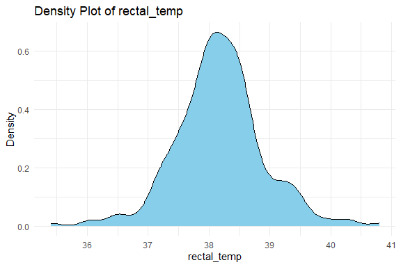

Horse Survival Prediction
================
Trevor Okinda
2024

- [Student Details](#student-details)
- [Setup Chunk](#setup-chunk)
  - [Source:](#source)
  - [Reference:](#reference)
- [Exploratory Data Analysis](#exploratory-data-analysis)
  - [Load dataset](#load-dataset)
  - [Measures of Frequency](#measures-of-frequency)
  - [Measures of Central Tendency](#measures-of-central-tendency)
  - [Measures of Relationship](#measures-of-relationship)
  - [ANOVA](#anova)
  - [Plots](#plots)
- [Preprocessing and Data
  Transformation](#preprocessing-and-data-transformation)
  - [Missing Values](#missing-values)
  - [Imputation](#imputation)
- [Training Model](#training-model)
  - [Data Splitting](#data-splitting)
  - [Boostrapping](#boostrapping)

# Student Details

|                       |                           |
|-----------------------|---------------------------|
| **Student ID Number** | 134780                    |
| **Student Name**      | Trevor Okinda             |
| **BBIT 4.2 Group**    | C                         |
| **Project Name**      | Horse Survival Prediction |

# Setup Chunk

**Note:** the following KnitR options have been set as the global
defaults: <BR>
`knitr::opts_chunk$set(echo = TRUE, warning = FALSE, eval = TRUE, collapse = FALSE, tidy = TRUE)`.

More KnitR options are documented here
<https://bookdown.org/yihui/rmarkdown-cookbook/chunk-options.html> and
here <https://yihui.org/knitr/options/>.

### Source:

The dataset that was used can be downloaded here: *\<<a
href="https://www.kaggle.com/datasets/yasserh/horse-survival-dataset\"
class="uri">https://www.kaggle.com/datasets/yasserh/horse-survival-dataset\</a>\>*

### Reference:

*\<Yasser, M. H. (n.d.). Horse Survival Dataset. Retrieved from <a
href="https://www.kaggle.com/datasets/yasserh/horse-survival-dataset\"
class="uri">https://www.kaggle.com/datasets/yasserh/horse-survival-dataset\</a>\>  
Refer to the APA 7th edition manual for rules on how to cite datasets:
<https://apastyle.apa.org/style-grammar-guidelines/references/examples/data-set-references>*

# Exploratory Data Analysis

## Load dataset

``` r
# Load dataset
horse_data <- read.csv("horse.csv", colClasses = c(
  surgery = "factor",
  age = "factor",
  hospital_number = "integer",
  rectal_temp = "numeric",
  pulse = "integer",
  respiratory_rate = "numeric",
  temp_of_extremities = "factor",
  peripheral_pulse = "factor",
  mucous_membrane = "factor",
  capillary_refill_time = "factor",
  pain = "factor",
  peristalsis = "factor",
  abdominal_distention = "factor",
  nasogastric_tube = "factor",
  nasogastric_reflux = "factor",
  nasogastric_reflux_ph = "numeric",
  rectal_exam_feces = "factor",
  abdomen = "factor",
  packed_cell_volume = "numeric",
  total_protein = "numeric",
  abdomo_appearance = "factor",
  abdomo_protein = "factor",
  outcome = "factor",
  surgical_lesion = "factor",
  lesion_1 = "numeric",
  lesion_2 = "numeric",
  lesion_3 = "numeric",
  cp_data = "factor"
))

# Display the structure of the dataset
str(horse_data)
```

    ## 'data.frame':    299 obs. of  28 variables:
    ##  $ surgery              : Factor w/ 2 levels "no","yes": 1 2 1 2 1 1 2 2 1 1 ...
    ##  $ age                  : Factor w/ 2 levels "adult","young": 1 1 1 2 1 1 1 1 1 2 ...
    ##  $ hospital_number      : int  530101 534817 530334 5290409 530255 528355 526802 529607 530051 5299629 ...
    ##  $ rectal_temp          : num  38.5 39.2 38.3 39.1 37.3 NA 37.9 NA NA 38.3 ...
    ##  $ pulse                : int  66 88 40 164 104 NA 48 60 80 90 ...
    ##  $ respiratory_rate     : num  28 20 24 84 35 NA 16 NA 36 NA ...
    ##  $ temp_of_extremities  : Factor w/ 5 levels "","cold","cool",..: 3 1 4 2 1 5 4 3 3 4 ...
    ##  $ peripheral_pulse     : Factor w/ 5 levels "","absent","increased",..: 5 1 4 4 1 4 4 1 2 1 ...
    ##  $ mucous_membrane      : Factor w/ 7 levels "","bright_pink",..: 1 6 7 4 4 7 5 1 7 5 ...
    ##  $ capillary_refill_time: Factor w/ 4 levels "","3","less_3_sec",..: 4 3 3 4 4 3 3 3 3 3 ...
    ##  $ pain                 : Factor w/ 6 levels "","alert","depressed",..: 4 5 5 3 1 3 5 1 6 4 ...
    ##  $ peristalsis          : Factor w/ 5 levels "","absent","hypermotile",..: 2 2 4 2 1 4 4 2 2 4 ...
    ##  $ abdominal_distention : Factor w/ 5 levels "","moderate",..: 4 5 3 4 1 5 2 5 4 3 ...
    ##  $ nasogastric_tube     : Factor w/ 4 levels "","none","significant",..: 1 1 1 2 1 4 2 4 4 4 ...
    ##  $ nasogastric_reflux   : Factor w/ 4 levels "","less_1_liter",..: 1 1 1 2 1 4 4 4 4 4 ...
    ##  $ nasogastric_reflux_ph: num  NA NA NA 5 NA NA NA NA NA NA ...
    ##  $ rectal_exam_feces    : Factor w/ 5 levels "","absent","decreased",..: 3 2 5 3 1 3 3 3 3 3 ...
    ##  $ abdomen              : Factor w/ 6 levels "","distend_large",..: 2 6 5 1 1 4 2 3 2 1 ...
    ##  $ packed_cell_volume   : num  45 50 33 48 74 NA 37 44 38 40 ...
    ##  $ total_protein        : num  8.4 85 6.7 7.2 7.4 NA 7 8.3 6.2 6.2 ...
    ##  $ abdomo_appearance    : Factor w/ 4 levels "","clear","cloudy",..: 1 3 1 4 1 1 1 1 1 2 ...
    ##  $ abdomo_protein       : Factor w/ 38 levels "","0.1","1","1.3",..: 1 10 1 33 1 1 1 1 1 12 ...
    ##  $ outcome              : Factor w/ 3 levels "died","euthanized",..: 1 2 3 1 1 3 3 1 2 3 ...
    ##  $ surgical_lesion      : Factor w/ 2 levels "no","yes": 1 1 1 2 1 1 2 2 2 1 ...
    ##  $ lesion_1             : num  11300 2208 0 2208 4300 ...
    ##  $ lesion_2             : num  0 0 0 0 0 0 0 0 0 0 ...
    ##  $ lesion_3             : num  0 0 0 0 0 0 0 0 0 0 ...
    ##  $ cp_data              : Factor w/ 2 levels "no","yes": 1 1 2 2 1 1 1 1 1 2 ...

``` r
# View the first few rows of the dataset
head(horse_data)
```

    ##   surgery   age hospital_number rectal_temp pulse respiratory_rate
    ## 1      no adult          530101        38.5    66               28
    ## 2     yes adult          534817        39.2    88               20
    ## 3      no adult          530334        38.3    40               24
    ## 4     yes young         5290409        39.1   164               84
    ## 5      no adult          530255        37.3   104               35
    ## 6      no adult          528355          NA    NA               NA
    ##   temp_of_extremities peripheral_pulse mucous_membrane capillary_refill_time
    ## 1                cool          reduced                            more_3_sec
    ## 2                                        pale_cyanotic            less_3_sec
    ## 3              normal           normal       pale_pink            less_3_sec
    ## 4                cold           normal   dark_cyanotic            more_3_sec
    ## 5                                        dark_cyanotic            more_3_sec
    ## 6                warm           normal       pale_pink            less_3_sec
    ##           pain peristalsis abdominal_distention nasogastric_tube
    ## 1 extreme_pain      absent               severe                 
    ## 2    mild_pain      absent               slight                 
    ## 3    mild_pain  hypomotile                 none                 
    ## 4    depressed      absent               severe             none
    ## 5                                                               
    ## 6    depressed  hypomotile               slight           slight
    ##   nasogastric_reflux nasogastric_reflux_ph rectal_exam_feces       abdomen
    ## 1                                       NA         decreased distend_large
    ## 2                                       NA            absent         other
    ## 3                                       NA            normal        normal
    ## 4       less_1_liter                     5         decreased              
    ## 5                                       NA                                
    ## 6               none                    NA         decreased          firm
    ##   packed_cell_volume total_protein abdomo_appearance abdomo_protein    outcome
    ## 1                 45           8.4                                        died
    ## 2                 50          85.0            cloudy              2 euthanized
    ## 3                 33           6.7                                       lived
    ## 4                 48           7.2     serosanguious            5.3       died
    ## 5                 74           7.4                                        died
    ## 6                 NA            NA                                       lived
    ##   surgical_lesion lesion_1 lesion_2 lesion_3 cp_data
    ## 1              no    11300        0        0      no
    ## 2              no     2208        0        0      no
    ## 3              no        0        0        0     yes
    ## 4             yes     2208        0        0     yes
    ## 5              no     4300        0        0      no
    ## 6              no        0        0        0      no

``` r
# View the dataset in a separate viewer window
View(horse_data)
```

## Measures of Frequency

``` r
# Measures of Frequency
# Frequency table for categorical variables
cat_vars <- c("surgery", "age", "temp_of_extremities", "peripheral_pulse", 
              "mucous_membrane", "capillary_refill_time", "pain", 
              "peristalsis", "abdominal_distention", "nasogastric_tube", 
              "nasogastric_reflux", "rectal_exam_feces", "abdomen", 
              "abdomo_appearance", "abdomo_protein", "outcome", 
              "surgical_lesion", "cp_data")

cat_freq <- lapply(horse_data[cat_vars], table)
cat_freq_summary <- lapply(cat_freq, summary)

# Frequency table for numerical variables
num_vars <- c("rectal_temp", "pulse", "respiratory_rate", 
              "nasogastric_reflux_ph", "packed_cell_volume", "total_protein", 
              "lesion_1", "lesion_2", "lesion_3")

num_freq_summary <- lapply(horse_data[num_vars], summary)

# Print frequency tables
cat_freq_summary
```

    ## $surgery
    ## Number of cases in table: 299 
    ## Number of factors: 1 
    ## 
    ## $age
    ## Number of cases in table: 299 
    ## Number of factors: 1 
    ## 
    ## $temp_of_extremities
    ## Number of cases in table: 299 
    ## Number of factors: 1 
    ## 
    ## $peripheral_pulse
    ## Number of cases in table: 299 
    ## Number of factors: 1 
    ## 
    ## $mucous_membrane
    ## Number of cases in table: 299 
    ## Number of factors: 1 
    ## 
    ## $capillary_refill_time
    ## Number of cases in table: 299 
    ## Number of factors: 1 
    ## 
    ## $pain
    ## Number of cases in table: 299 
    ## Number of factors: 1 
    ## 
    ## $peristalsis
    ## Number of cases in table: 299 
    ## Number of factors: 1 
    ## 
    ## $abdominal_distention
    ## Number of cases in table: 299 
    ## Number of factors: 1 
    ## 
    ## $nasogastric_tube
    ## Number of cases in table: 299 
    ## Number of factors: 1 
    ## 
    ## $nasogastric_reflux
    ## Number of cases in table: 299 
    ## Number of factors: 1 
    ## 
    ## $rectal_exam_feces
    ## Number of cases in table: 299 
    ## Number of factors: 1 
    ## 
    ## $abdomen
    ## Number of cases in table: 299 
    ## Number of factors: 1 
    ## 
    ## $abdomo_appearance
    ## Number of cases in table: 299 
    ## Number of factors: 1 
    ## 
    ## $abdomo_protein
    ## Number of cases in table: 299 
    ## Number of factors: 1 
    ## 
    ## $outcome
    ## Number of cases in table: 299 
    ## Number of factors: 1 
    ## 
    ## $surgical_lesion
    ## Number of cases in table: 299 
    ## Number of factors: 1 
    ## 
    ## $cp_data
    ## Number of cases in table: 299 
    ## Number of factors: 1

``` r
num_freq_summary
```

    ## $rectal_temp
    ##    Min. 1st Qu.  Median    Mean 3rd Qu.    Max.    NA's 
    ##   35.40   37.80   38.20   38.17   38.50   40.80      60 
    ## 
    ## $pulse
    ##    Min. 1st Qu.  Median    Mean 3rd Qu.    Max.    NA's 
    ##      30      48      64      72      88     184      24 
    ## 
    ## $respiratory_rate
    ##    Min. 1st Qu.  Median    Mean 3rd Qu.    Max.    NA's 
    ##    8.00   18.00   25.00   30.46   36.00   96.00      58 
    ## 
    ## $nasogastric_reflux_ph
    ##    Min. 1st Qu.  Median    Mean 3rd Qu.    Max.    NA's 
    ##   1.000   3.000   5.000   4.708   6.500   7.500     246 
    ## 
    ## $packed_cell_volume
    ##    Min. 1st Qu.  Median    Mean 3rd Qu.    Max.    NA's 
    ##   23.00   38.00   45.00   46.31   52.00   75.00      29 
    ## 
    ## $total_protein
    ##    Min. 1st Qu.  Median    Mean 3rd Qu.    Max.    NA's 
    ##    3.30    6.50    7.50   24.27   56.75   89.00      33 
    ## 
    ## $lesion_1
    ##    Min. 1st Qu.  Median    Mean 3rd Qu.    Max. 
    ##       0    2112    2322    3660    3209   41110 
    ## 
    ## $lesion_2
    ##    Min. 1st Qu.  Median    Mean 3rd Qu.    Max. 
    ##    0.00    0.00    0.00   90.53    0.00 7111.00 
    ## 
    ## $lesion_3
    ##     Min.  1st Qu.   Median     Mean  3rd Qu.     Max. 
    ##    0.000    0.000    0.000    7.388    0.000 2209.000

## Measures of Central Tendency

``` r
# Measures of Central Tendency for Numerical Variables
num_vars <- c("rectal_temp", "pulse", "respiratory_rate", 
              "nasogastric_reflux_ph", "packed_cell_volume", "total_protein", 
              "lesion_1", "lesion_2", "lesion_3")

# Mean
num_means <- sapply(horse_data[num_vars], mean, na.rm = TRUE)

# Median
num_medians <- sapply(horse_data[num_vars], median, na.rm = TRUE)

# Mode (custom function)
get_mode <- function(x) {
  uniq_x <- unique(x)
  uniq_x[which.max(tabulate(match(x, uniq_x)))]
}
num_modes <- sapply(horse_data[num_vars], get_mode)

# Print measures of central tendency for numerical variables
num_central_tendency <- data.frame(mean = num_means, median = num_medians, mode = num_modes)
num_central_tendency
```

    ##                              mean median mode
    ## rectal_temp             38.168619   38.2   NA
    ## pulse                   72.000000   64.0   48
    ## respiratory_rate        30.460581   25.0   NA
    ## nasogastric_reflux_ph    4.707547    5.0   NA
    ## packed_cell_volume      46.307407   45.0   NA
    ## total_protein           24.274436    7.5   NA
    ## lesion_1              3659.709030 2322.0    0
    ## lesion_2                90.528428    0.0    0
    ## lesion_3                 7.387960    0.0    0

## Measures of Relationship

``` r
# Measures of Relationship

# Correlation analysis for numerical variables
num_vars <- c("rectal_temp", "pulse", "respiratory_rate", 
              "nasogastric_reflux_ph", "packed_cell_volume", "total_protein", 
              "lesion_1", "lesion_2", "lesion_3")

# Compute correlation matrix
num_correlation <- cor(horse_data[num_vars], use = "complete.obs")

# Print correlation matrix
num_correlation
```

    ##                       rectal_temp       pulse respiratory_rate
    ## rectal_temp             1.0000000  0.37793937       0.29605013
    ## pulse                   0.3779394  1.00000000       0.42105171
    ## respiratory_rate        0.2960501  0.42105171       1.00000000
    ## nasogastric_reflux_ph   0.2394384 -0.04400919       0.12751493
    ## packed_cell_volume      0.1588728  0.33369649      -0.01899864
    ## total_protein          -0.1420915 -0.10143341      -0.17033168
    ## lesion_1                0.1969781 -0.12686919       0.29448681
    ## lesion_2                       NA          NA               NA
    ## lesion_3                       NA          NA               NA
    ##                       nasogastric_reflux_ph packed_cell_volume total_protein
    ## rectal_temp                      0.23943835         0.15887278    -0.1420915
    ## pulse                           -0.04400919         0.33369649    -0.1014334
    ## respiratory_rate                 0.12751493        -0.01899864    -0.1703317
    ## nasogastric_reflux_ph            1.00000000        -0.09702405    -0.6806628
    ## packed_cell_volume              -0.09702405         1.00000000     0.2828146
    ## total_protein                   -0.68066276         0.28281464     1.0000000
    ## lesion_1                         0.07199408        -0.27808131    -0.1464783
    ## lesion_2                                 NA                 NA            NA
    ## lesion_3                                 NA                 NA            NA
    ##                          lesion_1 lesion_2 lesion_3
    ## rectal_temp            0.19697811       NA       NA
    ## pulse                 -0.12686919       NA       NA
    ## respiratory_rate       0.29448681       NA       NA
    ## nasogastric_reflux_ph  0.07199408       NA       NA
    ## packed_cell_volume    -0.27808131       NA       NA
    ## total_protein         -0.14647832       NA       NA
    ## lesion_1               1.00000000       NA       NA
    ## lesion_2                       NA        1       NA
    ## lesion_3                       NA       NA        1

``` r
# Contingency tables for categorical variables
cat_vars <- c("surgery", "age", "temp_of_extremities", "peripheral_pulse", 
              "mucous_membrane", "capillary_refill_time", "pain", 
              "peristalsis", "abdominal_distention", "nasogastric_tube", 
              "nasogastric_reflux", "rectal_exam_feces", "abdomen", 
              "abdomo_appearance", "abdomo_protein", "outcome", 
              "surgical_lesion", "cp_data")

# Compute contingency tables
cat_contingency_tables <- lapply(horse_data[cat_vars], table)

# Print contingency tables
cat_contingency_tables
```

    ## $surgery
    ## 
    ##  no yes 
    ## 119 180 
    ## 
    ## $age
    ## 
    ## adult young 
    ##   275    24 
    ## 
    ## $temp_of_extremities
    ## 
    ##          cold   cool normal   warm 
    ##     56     27    108     78     30 
    ## 
    ## $peripheral_pulse
    ## 
    ##              absent increased    normal   reduced 
    ##        69         8         5       114       103 
    ## 
    ## $mucous_membrane
    ## 
    ##                 bright_pink    bright_red dark_cyanotic   normal_pink 
    ##            47            30            25            20            79 
    ## pale_cyanotic     pale_pink 
    ##            41            57 
    ## 
    ## $capillary_refill_time
    ## 
    ##                     3 less_3_sec more_3_sec 
    ##         32          2        187         78 
    ## 
    ## $pain
    ## 
    ##                     alert    depressed extreme_pain    mild_pain  severe_pain 
    ##           55           38           59           42           67           38 
    ## 
    ## $peristalsis
    ## 
    ##                  absent hypermotile  hypomotile      normal 
    ##          44          73          39         127          16 
    ## 
    ## $abdominal_distention
    ## 
    ##          moderate     none   severe   slight 
    ##       56       65       75       38       65 
    ## 
    ## $nasogastric_tube
    ## 
    ##                    none significant      slight 
    ##         104          71          23         101 
    ## 
    ## $nasogastric_reflux
    ## 
    ##              less_1_liter more_1_liter         none 
    ##          106           35           39          119 
    ## 
    ## $rectal_exam_feces
    ## 
    ##              absent decreased increased    normal 
    ##       102        79        48        13        57 
    ## 
    ## $abdomen
    ## 
    ##               distend_large distend_small          firm        normal 
    ##           118            78            43            13            28 
    ##         other 
    ##            19 
    ## 
    ## $abdomo_appearance
    ## 
    ##                       clear        cloudy serosanguious 
    ##           165            41            47            46 
    ## 
    ## $abdomo_protein
    ## 
    ##       0.1    1  1.3  1.4  1.5  1.6   10 10.1    2  2.1  2.2  2.3  2.5  2.6  2.8 
    ##  198    1   16    1    1    1    2    1    1   26    1    1    2    1    4    3 
    ##  2.9    3  3.2  3.3  3.4  3.6  3.7  3.9  4.1  4.3  4.4  4.5  4.7  4.8    5  5.2 
    ##    1    2    1    1    3    3    1    4    2    2    1    2    1    1    3    1 
    ##  5.3    6  6.6    7  7.4    8 
    ##    2    2    1    3    1    1 
    ## 
    ## $outcome
    ## 
    ##       died euthanized      lived 
    ##         77         44        178 
    ## 
    ## $surgical_lesion
    ## 
    ##  no yes 
    ## 109 190 
    ## 
    ## $cp_data
    ## 
    ##  no yes 
    ## 200  99

## ANOVA

``` r
# ANOVA (Analysis of Variance)

# Example: ANOVA for the 'age' variable (categorical) and the 'pulse' variable (numerical)
anova_result <- aov(pulse ~ age, data = horse_data)

# Print ANOVA table
summary(anova_result)
```

    ##              Df Sum Sq Mean Sq F value Pr(>F)    
    ## age           1  63088   63088   106.5 <2e-16 ***
    ## Residuals   273 161758     593                   
    ## ---
    ## Signif. codes:  0 '***' 0.001 '**' 0.01 '*' 0.05 '.' 0.1 ' ' 1
    ## 24 observations deleted due to missingness

## Plots

``` r
library(ggplot2)

# Numerical Variables
num_vars <- c("rectal_temp", "pulse", "respiratory_rate", 
              "nasogastric_reflux_ph", "packed_cell_volume", "total_protein", 
              "lesion_1", "lesion_2", "lesion_3")

# Create histograms for numerical variables
histograms <- lapply(num_vars, function(var) {
  ggplot(horse_data, aes_string(x = var)) +
    geom_histogram(fill = "skyblue", color = "black", bins = 20) +
    labs(title = paste("Histogram of", var), x = var, y = "Frequency") +
    theme_minimal()
})

# Create boxplots for numerical variables
boxplots <- lapply(num_vars, function(var) {
  ggplot(horse_data, aes_string(y = var)) +
    geom_boxplot(fill = "lightgreen", color = "black") +
    labs(title = paste("Boxplot of", var), y = var) +
    theme_minimal()
})

# Print histograms and boxplots
print(histograms[[1]])  # Print first histogram
```

<!-- -->

``` r
print(boxplots[[1]])     # Print first boxplot
```

<!-- -->

``` r
library(ggplot2)

# Numerical Variables
num_vars <- c("rectal_temp", "pulse", "respiratory_rate", 
              "nasogastric_reflux_ph", "packed_cell_volume", "total_protein", 
              "lesion_1", "lesion_2", "lesion_3")

# Create histograms for numerical variables
num_histograms <- lapply(num_vars, function(var) {
  ggplot(horse_data, aes_string(x = var)) +
    geom_histogram(fill = "skyblue", color = "black", bins = 20) +
    labs(title = paste("Histogram of", var), x = var, y = "Frequency") +
    theme_minimal()
})

# Create density plots for numerical variables
num_density_plots <- lapply(num_vars, function(var) {
  ggplot(horse_data, aes_string(x = var)) +
    geom_density(fill = "skyblue", color = "black") +
    labs(title = paste("Density Plot of", var), x = var, y = "Density") +
    theme_minimal()
})

# Create boxplots for numerical variables
num_boxplots <- lapply(num_vars, function(var) {
  ggplot(horse_data, aes_string(y = var)) +
    geom_boxplot(fill = "lightgreen", color = "black") +
    labs(title = paste("Boxplot of", var), y = var) +
    theme_minimal()
})

# Print numerical univariate plots
print(num_histograms[[1]])  # Print first histogram
```

<!-- -->

``` r
print(num_density_plots[[1]])  # Print first density plot
```

<!-- -->

``` r
print(num_boxplots[[1]])     # Print first boxplot
```

<!-- -->

``` r
# Categorical Variables
cat_vars <- c("surgery", "age", "temp_of_extremities", "peripheral_pulse", 
              "mucous_membrane", "capillary_refill_time", "pain", 
              "peristalsis", "abdominal_distention", "nasogastric_tube", 
              "nasogastric_reflux", "rectal_exam_feces", "abdomen", 
              "abdomo_appearance", "abdomo_protein", "outcome", 
              "surgical_lesion", "cp_data")

# Create barplots for categorical variables
cat_barplots <- lapply(cat_vars, function(var) {
  ggplot(horse_data, aes_string(x = var)) +
    geom_bar(fill = "skyblue", color = "black") +
    labs(title = paste("Barplot of", var), x = var, y = "Count") +
    theme_minimal() +
    theme(axis.text.x = element_text(angle = 45, hjust = 1))
})

# Print categorical univariate plots
print(cat_barplots[[1]])  # Print first barplot
```

<!-- -->

``` r
library(ggplot2)

# Scatter plots for numerical variables
scatter_plots <- lapply(num_vars, function(var) {
  ggplot(horse_data, aes_string(x = var)) +
    geom_point(aes_string(y = "pulse", color = "surgery"), alpha = 0.5) +
    labs(title = paste("Scatter Plot of", var, "vs. Pulse"), x = var, y = "Pulse") +
    theme_minimal()
})

# Boxplots for numerical variables by categorical variables
boxplots_by_cat <- lapply(cat_vars, function(cat_var) {
  lapply(num_vars, function(num_var) {
    ggplot(horse_data, aes_string(x = cat_var, y = num_var, fill = cat_var)) +
      geom_boxplot() +
      labs(title = paste("Boxplot of", num_var, "by", cat_var), x = cat_var, y = num_var) +
      theme_minimal()
  })
})

# Print scatter plots
print(scatter_plots[[3]])  # Print first scatter plot
```

<!-- -->

``` r
# Print boxplots by categorical variables
print(boxplots_by_cat[[1]][[1]])  # Print first boxplot by the first categorical variable
```

<!-- -->

# Preprocessing and Data Transformation

## Missing Values

``` r
# Summarize missing values for each variable
missing_values_summary <- sapply(horse_data, function(x) sum(is.na(x) | is.null(x)))
print("Summary of Missing Values:")
```

    ## [1] "Summary of Missing Values:"

``` r
print(missing_values_summary)
```

    ##               surgery                   age       hospital_number 
    ##                     0                     0                     0 
    ##           rectal_temp                 pulse      respiratory_rate 
    ##                    60                    24                    58 
    ##   temp_of_extremities      peripheral_pulse       mucous_membrane 
    ##                     0                     0                     0 
    ## capillary_refill_time                  pain           peristalsis 
    ##                     0                     0                     0 
    ##  abdominal_distention      nasogastric_tube    nasogastric_reflux 
    ##                     0                     0                     0 
    ## nasogastric_reflux_ph     rectal_exam_feces               abdomen 
    ##                   246                     0                     0 
    ##    packed_cell_volume         total_protein     abdomo_appearance 
    ##                    29                    33                     0 
    ##        abdomo_protein               outcome       surgical_lesion 
    ##                     0                     0                     0 
    ##              lesion_1              lesion_2              lesion_3 
    ##                     0                     0                     0 
    ##               cp_data 
    ##                     0

## Imputation

``` r
# Impute missing values 
# Mean imputation for numerical variables
for (var in num_vars) {
  if (sum(is.na(horse_data[[var]])) > 0) {
    horse_data[[var]][is.na(horse_data[[var]])] <- mean(horse_data[[var]], na.rm = TRUE)
  }
}

# Mode imputation for categorical variables
for (var in cat_vars) {
  if (sum(is.na(horse_data[[var]])) > 0) {
    mode_val <- names(sort(table(horse_data[[var]], useNA = "always"), decreasing = TRUE)[1])
    horse_data[[var]][is.na(horse_data[[var]])] <- mode_val
  }
}

# Verify if missing values are imputed
missing_values_after_imputation <- colSums(is.na(horse_data))
print(missing_values_after_imputation)
```

    ##               surgery                   age       hospital_number 
    ##                     0                     0                     0 
    ##           rectal_temp                 pulse      respiratory_rate 
    ##                     0                     0                     0 
    ##   temp_of_extremities      peripheral_pulse       mucous_membrane 
    ##                     0                     0                     0 
    ## capillary_refill_time                  pain           peristalsis 
    ##                     0                     0                     0 
    ##  abdominal_distention      nasogastric_tube    nasogastric_reflux 
    ##                     0                     0                     0 
    ## nasogastric_reflux_ph     rectal_exam_feces               abdomen 
    ##                     0                     0                     0 
    ##    packed_cell_volume         total_protein     abdomo_appearance 
    ##                     0                     0                     0 
    ##        abdomo_protein               outcome       surgical_lesion 
    ##                     0                     0                     0 
    ##              lesion_1              lesion_2              lesion_3 
    ##                     0                     0                     0 
    ##               cp_data 
    ##                     0

``` r
# View the imputed dataset
print(horse_data)  # Print the entire dataset
```

    ##     surgery   age hospital_number rectal_temp pulse respiratory_rate
    ## 1        no adult          530101    38.50000    66         28.00000
    ## 2       yes adult          534817    39.20000    88         20.00000
    ## 3        no adult          530334    38.30000    40         24.00000
    ## 4       yes young         5290409    39.10000   164         84.00000
    ## 5        no adult          530255    37.30000   104         35.00000
    ## 6        no adult          528355    38.16862    72         30.46058
    ## 7       yes adult          526802    37.90000    48         16.00000
    ## 8       yes adult          529607    38.16862    60         30.46058
    ## 9        no adult          530051    38.16862    80         36.00000
    ## 10       no young         5299629    38.30000    90         30.46058
    ## 11      yes adult          528548    38.10000    66         12.00000
    ## 12       no adult          527927    39.10000    72         52.00000
    ## 13      yes adult          528031    37.20000    42         12.00000
    ## 14       no young         5291329    38.00000    92         28.00000
    ## 15      yes adult          534917    38.20000    76         28.00000
    ## 16      yes adult          530233    37.60000    96         48.00000
    ## 17      yes young         5301219    38.16862   128         36.00000
    ## 18       no adult          526639    37.50000    48         24.00000
    ## 19      yes adult         5290481    37.60000    64         21.00000
    ## 20       no adult          532110    39.40000   110         35.00000
    ## 21      yes adult          530157    39.90000    72         60.00000
    ## 22       no adult          529340    38.40000    48         16.00000
    ## 23      yes adult          521681    38.60000    42         34.00000
    ## 24      yes young          534998    38.30000   130         60.00000
    ## 25      yes adult          533692    38.10000    60         12.00000
    ## 26       no adult          529518    37.80000    60         42.00000
    ## 27      yes adult          530526    38.30000    72         30.00000
    ## 28      yes adult          528653    37.80000    48         12.00000
    ## 29      yes adult         5279442    38.16862    72         30.46058
    ## 30       no adult          535415    37.70000    48         30.46058
    ## 31       no adult          529475    37.70000    96         30.00000
    ## 32       no adult          530242    37.20000   108         12.00000
    ## 33      yes adult          529427    37.20000    60         30.46058
    ## 34      yes adult          529663    38.20000    64         28.00000
    ## 35      yes adult          529796    38.16862   100         30.00000
    ## 36       no adult          528812    38.16862   104         24.00000
    ## 37       no adult          529493    38.30000   112         16.00000
    ## 38      yes adult          533847    37.80000    72         30.46058
    ## 39       no adult          528996    38.60000    52         30.46058
    ## 40      yes young         5277409    39.20000   146         96.00000
    ## 41      yes adult          529498    38.16862    88         30.46058
    ## 42       no young         5288249    39.00000   150         72.00000
    ## 43       no adult          530301    38.00000    60         12.00000
    ## 44      yes adult          534069    38.16862   120         30.46058
    ## 45      yes adult          535407    35.40000   140         24.00000
    ## 46       no adult          529827    38.16862   120         30.46058
    ## 47      yes adult          529888    37.90000    60         15.00000
    ## 48       no adult          529821    37.50000    48         16.00000
    ## 49      yes adult          528890    38.90000    80         44.00000
    ## 50       no adult          529642    37.20000    84         48.00000
    ## 51       no adult          529766    38.60000    46         30.46058
    ## 52      yes adult          527706    37.40000    84         36.00000
    ## 53       no adult          529483    38.16862    72         30.46058
    ## 54       no adult          530544    38.60000    40         20.00000
    ## 55       no adult          529461    40.30000   114         36.00000
    ## 56      yes young         5282839    38.60000   160         20.00000
    ## 57      yes adult          528872    38.16862    72         30.46058
    ## 58      yes adult          529640    38.16862    64         36.00000
    ## 59      yes adult          528298    38.16862    72         20.00000
    ## 60       no adult          528904    38.16862    96         30.46058
    ## 61       no adult          530438    37.80000    48         32.00000
    ## 62       no adult          527957    38.50000    60         30.46058
    ## 63      yes adult          528630    37.80000    88         22.00000
    ## 64       no adult          534293    38.20000   130         16.00000
    ## 65      yes adult          529667    39.00000    64         36.00000
    ## 66      yes adult          534885    38.16862    60         36.00000
    ## 67       no adult          534784    37.90000    72         30.46058
    ## 68       no adult          528931    38.40000    54         24.00000
    ## 69       no adult          529777    38.16862    52         16.00000
    ## 70       no adult          530276    38.00000    48         12.00000
    ## 71       no adult          528214    37.00000    60         20.00000
    ## 72      yes adult          529424    37.80000    48         28.00000
    ## 73      yes adult         5299253    37.70000    56         30.46058
    ## 74      yes adult          528469    38.10000    52         24.00000
    ## 75      yes young         5292929    38.16862    72         30.46058
    ## 76      yes young          534092    39.70000   100         30.46058
    ## 77      yes adult          534615    37.60000    38         20.00000
    ## 78       no adult          534753    38.70000    52         20.00000
    ## 79      yes adult          530693    38.16862    72         30.46058
    ## 80      yes adult          527463    37.50000    96         18.00000
    ## 81      yes adult          527518    36.40000    98         35.00000
    ## 82      yes adult          534756    37.30000    40         30.46058
    ## 83      yes young         5290759    38.10000   100         80.00000
    ## 84      yes adult         5279822    38.00000    72         24.00000
    ## 85      yes adult          529849    37.80000    60         80.00000
    ## 86       no adult          529304    38.00000    54         30.00000
    ## 87      yes adult          529388    38.16862    88         40.00000
    ## 88       no adult          528006    38.16862    40         16.00000
    ## 89       no adult          529703    39.00000    64         40.00000
    ## 90       no adult          535381    38.30000    42         10.00000
    ## 91       no adult          534197    38.00000    52         16.00000
    ## 92       no adult          529461    40.30000   114         36.00000
    ## 93       no adult          530251    38.80000    50         20.00000
    ## 94       no adult          530310    38.16862    72         30.46058
    ## 95       no adult          528729    37.50000    48         30.00000
    ## 96      yes adult          535158    37.30000    48         20.00000
    ## 97       no adult          530319    38.16862    84         36.00000
    ## 98      yes adult          534145    38.10000    88         32.00000
    ## 99       no adult          534135    37.70000    44         40.00000
    ## 100      no adult          530002    39.60000   108         51.00000
    ## 101     yes adult          535364    38.20000    40         16.00000
    ## 102     yes adult          534899    38.16862    60         20.00000
    ## 103      no adult          534938    38.30000    40         16.00000
    ## 104     yes young         5292489    38.00000   140         68.00000
    ## 105     yes adult          527563    37.80000    52         24.00000
    ## 106     yes adult          530381    38.16862    70         36.00000
    ## 107     yes adult          528668    38.30000    52         96.00000
    ## 108      no adult          529764    37.30000    50         32.00000
    ## 109     yes adult          533696    38.70000    60         32.00000
    ## 110     yes young         5297379    38.40000    84         40.00000
    ## 111     yes adult          527544    38.16862    70         16.00000
    ## 112     yes adult          533736    38.30000    40         16.00000
    ## 113     yes adult          534963    38.16862    40         30.46058
    ## 114     yes adult          527933    36.80000    60         28.00000
    ## 115     yes adult          532349    38.40000    44         24.00000
    ## 116      no adult          533723    38.16862    72         40.00000
    ## 117     yes adult          535208    38.00000    44         12.00000
    ## 118      no adult         5290482    39.50000    72         30.46058
    ## 119     yes adult          533983    36.50000    78         30.00000
    ## 120      no adult          535166    38.10000    56         20.00000
    ## 121     yes adult          528682    39.40000    54         66.00000
    ## 122     yes adult          534556    38.30000    80         40.00000
    ## 123      no adult          534579    38.70000    40         28.00000
    ## 124     yes adult          530360    38.20000    64         24.00000
    ## 125      no adult          529840    37.60000    48         20.00000
    ## 126     yes adult          528461    38.00000    42         68.00000
    ## 127     yes adult          530384    38.70000    72         30.46058
    ## 128     yes adult         5262541    37.40000    50         32.00000
    ## 129     yes adult          535330    37.40000    84         20.00000
    ## 130     yes adult          527698    38.40000    49         30.46058
    ## 131     yes adult          528964    37.80000    30         12.00000
    ## 132      no adult          530670    37.60000    88         36.00000
    ## 133      no adult          530294    37.90000    40         24.00000
    ## 134     yes adult          527524    38.16862   100         30.46058
    ## 135     yes young         5287179    38.10000   136         48.00000
    ## 136     yes adult          530693    38.16862    72         30.46058
    ## 137     yes adult          534324    38.00000    48         30.46058
    ## 138      no adult          532349    38.00000    56         30.46058
    ## 139      no adult          534491    38.00000    60         32.00000
    ## 140     yes adult          529960    38.10000    44          9.00000
    ## 141      no adult          522979    36.00000    42         30.00000
    ## 142     yes adult          530402    38.16862   120         30.46058
    ## 143     yes adult          529424    37.80000    48         28.00000
    ## 144     yes adult          534519    37.10000    84         40.00000
    ## 145      no adult          535246    38.16862    80         32.00000
    ## 146     yes adult          534115    38.20000    48         30.46058
    ## 147      no adult          530001    38.00000    44         12.00000
    ## 148     yes adult          529272    38.30000   132         30.46058
    ## 149      no adult          535314    38.70000    48         24.00000
    ## 150      no adult          533793    38.90000    44         14.00000
    ## 151     yes adult          529399    39.30000    72         30.46058
    ## 152     yes adult          533836    38.16862   100         30.46058
    ## 153      no adult          528804    38.60000    48         20.00000
    ## 154      no adult          535163    38.80000    48         40.00000
    ## 155      no adult          528247    38.00000    48         20.00000
    ## 156      no adult          528996    38.60000    52         20.00000
    ## 157     yes adult          533928    37.80000    60         24.00000
    ## 158      no adult          528248    38.00000    42         40.00000
    ## 159      no adult          528134    38.16862    72         12.00000
    ## 160     yes adult          527916    38.16862    72         30.46058
    ## 161     yes adult          530431    38.30000    42         24.00000
    ## 162      no adult          535176    39.50000    60         10.00000
    ## 163     yes adult          533942    38.00000    66         20.00000
    ## 164     yes adult          528523    38.70000    76         30.46058
    ## 165     yes adult          534925    39.40000   120         48.00000
    ## 166     yes adult          527916    38.30000    40         18.00000
    ## 167      no adult          528299    38.16862    44         24.00000
    ## 168     yes adult          530254    38.40000   104         40.00000
    ## 169     yes adult          535085    38.16862    65         24.00000
    ## 170      no adult          532985    37.50000    44         20.00000
    ## 171      no adult          527677    39.00000    86         16.00000
    ## 172     yes adult          535292    38.50000   129         48.00000
    ## 173     yes adult          529729    38.16862   104         30.46058
    ## 174      no adult          518476    38.16862    72         30.46058
    ## 175     yes adult          527929    38.16862    72         30.46058
    ## 176     yes adult          535130    38.20000    60         30.00000
    ## 177     yes adult          523190    38.16862    68         14.00000
    ## 178     yes adult          533968    38.16862    60         30.00000
    ## 179      no adult          528151    38.50000   100         30.46058
    ## 180     yes adult          530239    38.40000    84         30.00000
    ## 181      no adult          528305    37.80000    48         14.00000
    ## 182     yes adult         5279822    38.00000    72         24.00000
    ## 183      no adult          534857    37.80000    56         16.00000
    ## 184      no adult          534053    38.20000    68         32.00000
    ## 185     yes adult          534833    38.50000   120         60.00000
    ## 186     yes adult         5278331    39.30000    64         90.00000
    ## 187     yes adult          527365    38.40000    80         30.00000
    ## 188     yes adult          533887    38.50000    60         30.46058
    ## 189     yes adult         5299603    38.30000    60         16.00000
    ## 190     yes adult          528742    37.10000    40          8.00000
    ## 191      no young         5287279    38.16862   100         44.00000
    ## 192     yes adult          534788    38.20000    48         18.00000
    ## 193     yes adult          529373    38.16862    60         48.00000
    ## 194      no adult          534163    37.90000    88         24.00000
    ## 195      no adult          533697    38.00000    44         12.00000
    ## 196      no adult          529628    38.50000    60         20.00000
    ## 197      no adult          521399    38.50000    96         36.00000
    ## 198      no adult          533885    38.30000    60         20.00000
    ## 199      no adult          534157    38.50000    60         40.00000
    ## 200     yes adult          528047    37.30000    48         12.00000
    ## 201     yes adult          528641    38.50000    86         30.46058
    ## 202     yes adult          534073    37.50000    48         40.00000
    ## 203      no adult          529685    37.20000    36          9.00000
    ## 204     yes adult          529528    39.20000    72         23.00000
    ## 205      no adult          528151    38.50000   100         30.46058
    ## 206     yes adult          535137    38.50000    96         30.00000
    ## 207     yes adult          530297    38.16862    72         30.46058
    ## 208     yes adult          535338    37.80000    88         80.00000
    ## 209      no adult          534478    37.50000    44         10.00000
    ## 210     yes adult          530401    37.90000    68         20.00000
    ## 211     yes adult          529893    38.00000    86         24.00000
    ## 212     yes young         5294369    38.90000   120         30.00000
    ## 213     yes adult          528183    37.60000    45         12.00000
    ## 214      no adult          529183    38.60000    56         32.00000
    ## 215     yes adult          529135    37.80000    40         12.00000
    ## 216      no adult          528977    38.16862    72         30.46058
    ## 217     yes adult         5279441    38.00000    76         18.00000
    ## 218     yes adult          535240    38.10000    40         36.00000
    ## 219     yes adult          529736    38.16862    52         28.00000
    ## 220     yes adult          535029    39.20000    88         58.00000
    ## 221     yes adult          535031    38.50000    92         40.00000
    ## 222     yes adult          528800    38.16862   112         13.00000
    ## 223     yes adult          528178    37.70000    66         12.00000
    ## 224     yes adult          535392    38.80000    50         14.00000
    ## 225      no adult          528931    38.40000    54         24.00000
    ## 226     yes adult          528503    39.20000   120         20.00000
    ## 227     yes young         5289419    38.16862    72         30.46058
    ## 228     yes adult          535196    37.30000    90         40.00000
    ## 229     yes young          534597    38.50000   120         70.00000
    ## 230     yes adult          534280    38.50000   104         40.00000
    ## 231      no adult          530028    39.50000    92         28.00000
    ## 232     yes adult         5262543    38.50000    30         18.00000
    ## 233     yes adult          530526    38.30000    72         30.00000
    ## 234      no adult          528729    37.50000    48         30.00000
    ## 235     yes adult          528469    38.10000    52         24.00000
    ## 236      no adult          528179    38.20000    42         26.00000
    ## 237      no adult          533750    37.90000    54         42.00000
    ## 238      no adult          528702    36.10000    88         30.46058
    ## 239     yes adult          534183    38.10000    70         22.00000
    ## 240     yes adult          529160    38.00000    90         30.00000
    ## 241     yes adult          529045    38.20000    52         16.00000
    ## 242     yes adult          530354    38.16862    36         32.00000
    ## 243     yes adult         5281091    38.40000    92         20.00000
    ## 244     yes young         5291409    38.20000   124         88.00000
    ## 245      no adult          528904    38.16862    96         30.46058
    ## 246     yes adult          530366    37.60000    68         32.00000
    ## 247     yes adult          530170    38.10000    88         24.00000
    ## 248     yes adult          527709    38.00000   108         60.00000
    ## 249      no adult          528169    38.20000    48         30.46058
    ## 250     yes adult          535043    39.30000   100         51.00000
    ## 251      no adult          527940    36.60000    42         18.00000
    ## 252     yes young         5291719    38.80000   124         36.00000
    ## 253      no adult          530561    38.16862   112         24.00000
    ## 254     yes adult          533738    38.16862    80         30.46058
    ## 255     yes young         5294539    38.80000   184         84.00000
    ## 256     yes adult          533871    37.50000    72         30.46058
    ## 257     yes adult          529812    38.70000    96         28.00000
    ## 258      no adult          534719    37.50000    52         12.00000
    ## 259     yes adult          527734    40.80000    72         42.00000
    ## 260      no adult          534933    38.00000    40         25.00000
    ## 261      no adult          529296    38.40000    48         16.00000
    ## 262      no young         5305629    38.60000    88         28.00000
    ## 263     yes adult          528743    37.10000    75         36.00000
    ## 264     yes adult          530478    38.30000    44         21.00000
    ## 265      no adult          528590    38.16862    56         68.00000
    ## 266      no adult          529865    38.60000    68         20.00000
    ## 267      no adult          527829    38.30000    54         18.00000
    ## 268     yes adult          534403    38.20000    42         20.00000
    ## 269     yes adult          527883    39.30000    64         90.00000
    ## 270     yes adult          528570    37.50000    60         50.00000
    ## 271     yes adult          534626    37.70000    80         30.46058
    ## 272     yes adult          529796    38.16862   100         30.00000
    ## 273     yes adult          528638    37.70000   120         28.00000
    ## 274     yes adult          534624    38.16862    76         30.46058
    ## 275     yes young         5297159    38.80000   150         50.00000
    ## 276     yes adult          534787    38.00000    36         16.00000
    ## 277      no adult          528620    36.90000    50         40.00000
    ## 278      no adult          528019    37.80000    40         16.00000
    ## 279      no adult          529172    38.20000    56         40.00000
    ## 280     yes adult          534644    38.60000    48         12.00000
    ## 281      no adult          530624    40.00000    78         30.46058
    ## 282     yes adult          527544    38.16862    70         16.00000
    ## 283     yes adult          527758    38.20000    72         18.00000
    ## 284      no adult          530439    38.50000    54         30.46058
    ## 285     yes adult         5283431    38.50000    66         24.00000
    ## 286      no adult         5275212    37.80000    82         12.00000
    ## 287      no young         5305129    39.50000    84         30.00000
    ## 288     yes adult          529428    38.16862    72         30.46058
    ## 289     yes adult          529126    38.00000    50         36.00000
    ## 290      no adult          535054    38.60000    45         16.00000
    ## 291     yes adult          528890    38.90000    80         44.00000
    ## 292     yes adult          530034    37.00000    66         20.00000
    ## 293     yes adult          534004    38.16862    78         24.00000
    ## 294      no adult          533902    38.50000    40         16.00000
    ## 295     yes adult          533886    38.16862   120         70.00000
    ## 296      no adult          527702    37.20000    72         24.00000
    ## 297     yes adult          529386    37.50000    72         30.00000
    ## 298     yes adult          530612    36.50000   100         24.00000
    ## 299     yes adult          534618    37.20000    40         20.00000
    ##     temp_of_extremities peripheral_pulse mucous_membrane capillary_refill_time
    ## 1                  cool          reduced                            more_3_sec
    ## 2                                          pale_cyanotic            less_3_sec
    ## 3                normal           normal       pale_pink            less_3_sec
    ## 4                  cold           normal   dark_cyanotic            more_3_sec
    ## 5                                          dark_cyanotic            more_3_sec
    ## 6                  warm           normal       pale_pink            less_3_sec
    ## 7                normal           normal     normal_pink            less_3_sec
    ## 8                  cool                                             less_3_sec
    ## 9                  cool           absent       pale_pink            less_3_sec
    ## 10               normal                      normal_pink            less_3_sec
    ## 11                 cool          reduced      bright_red            less_3_sec
    ## 12                 warm                      bright_pink            less_3_sec
    ## 13                 warm           normal     normal_pink            less_3_sec
    ## 14               normal           normal     bright_pink            less_3_sec
    ## 15                 cool           normal     normal_pink            less_3_sec
    ## 16                 cool           normal   pale_cyanotic            less_3_sec
    ## 17                 cool          reduced   pale_cyanotic            more_3_sec
    ## 18                                                                            
    ## 19               normal           normal     bright_pink            less_3_sec
    ## 20                 cold          reduced   dark_cyanotic                      
    ## 21               normal           normal      bright_red            more_3_sec
    ## 22               normal                      normal_pink            less_3_sec
    ## 23                 warm           normal   pale_cyanotic                      
    ## 24                               reduced                            less_3_sec
    ## 25                 cool          reduced       pale_pink            less_3_sec
    ## 26                                                                  less_3_sec
    ## 27                 cold          reduced       pale_pink            more_3_sec
    ## 28                 cool           normal     normal_pink            less_3_sec
    ## 29                                                                            
    ## 30                 warm           normal     normal_pink            less_3_sec
    ## 31                 cool          reduced   pale_cyanotic            more_3_sec
    ## 32                 cool          reduced   pale_cyanotic            more_3_sec
    ## 33                 warm           normal     normal_pink            less_3_sec
    ## 34               normal           normal     normal_pink            less_3_sec
    ## 35                 cool          reduced   pale_cyanotic            more_3_sec
    ## 36                 cold          reduced       pale_pink            more_3_sec
    ## 37                               reduced      bright_red            more_3_sec
    ## 38                               reduced                            less_3_sec
    ## 39               normal           normal     normal_pink            less_3_sec
    ## 40                                                                            
    ## 41                 cool          reduced   dark_cyanotic            more_3_sec
    ## 42                                                                            
    ## 43                 cool           normal       pale_pink            less_3_sec
    ## 44                 cool           absent   pale_cyanotic            less_3_sec
    ## 45                 cool          reduced   pale_cyanotic            more_3_sec
    ## 46                 cold          reduced   pale_cyanotic            more_3_sec
    ## 47                 cool                    pale_cyanotic            more_3_sec
    ## 48               normal           normal     normal_pink            less_3_sec
    ## 49                 cool          reduced       pale_pink            more_3_sec
    ## 50                 cool          reduced      bright_red            more_3_sec
    ## 51               normal           normal     bright_pink            less_3_sec
    ## 52               normal                        pale_pink            more_3_sec
    ## 53               normal           normal       pale_pink            less_3_sec
    ## 54                                                                  less_3_sec
    ## 55                 cool          reduced     normal_pink            more_3_sec
    ## 56                 cool                       bright_red            less_3_sec
    ## 57                                                                            
    ## 58                 warm                      bright_pink            less_3_sec
    ## 59                 cold          reduced       pale_pink                      
    ## 60                 cool          reduced       pale_pink            more_3_sec
    ## 61               normal           normal       pale_pink            less_3_sec
    ## 62                 warm        increased     normal_pink            less_3_sec
    ## 63                 warm           normal     bright_pink            less_3_sec
    ## 64                 cold          reduced   pale_cyanotic            more_3_sec
    ## 65                 cool           normal   pale_cyanotic            more_3_sec
    ## 66                 cool           normal       pale_pink            less_3_sec
    ## 67               normal           normal      bright_red            more_3_sec
    ## 68               normal           normal     normal_pink            less_3_sec
    ## 69               normal                        pale_pink            less_3_sec
    ## 70               normal           normal     normal_pink            less_3_sec
    ## 71                 cool                                             less_3_sec
    ## 72               normal           normal     normal_pink            less_3_sec
    ## 73                                                                            
    ## 74               normal           normal      bright_red            less_3_sec
    ## 75                                                                            
    ## 76                 cool          reduced      bright_red            more_3_sec
    ## 77                 cool          reduced     normal_pink            less_3_sec
    ## 78                 warm                      normal_pink            less_3_sec
    ## 79                 cool          reduced       pale_pink                     3
    ## 80               normal          reduced   dark_cyanotic            more_3_sec
    ## 81                 cool          reduced   pale_cyanotic            less_3_sec
    ## 82                               reduced     normal_pink            less_3_sec
    ## 83                 cool           normal     bright_pink            less_3_sec
    ## 84                 cool          reduced   dark_cyanotic            more_3_sec
    ## 85               normal          reduced     bright_pink            more_3_sec
    ## 86                 warm          reduced       pale_pink                     3
    ## 87                 cool          reduced   pale_cyanotic            more_3_sec
    ## 88                                                                  less_3_sec
    ## 89               normal           normal      bright_red            less_3_sec
    ## 90               normal           normal     normal_pink            less_3_sec
    ## 91                                                                            
    ## 92                 cool          reduced     normal_pink            more_3_sec
    ## 93                 cool           normal     normal_pink            less_3_sec
    ## 94                 cool          reduced     normal_pink            less_3_sec
    ## 95                 cold           normal       pale_pink            less_3_sec
    ## 96                                normal     bright_pink            less_3_sec
    ## 97                                             pale_pink            less_3_sec
    ## 98                 cool          reduced   pale_cyanotic            less_3_sec
    ## 99                 warm           normal       pale_pink            less_3_sec
    ## 100                cool          reduced   dark_cyanotic            more_3_sec
    ## 101                cool          reduced     normal_pink            less_3_sec
    ## 102                cold          reduced   pale_cyanotic            more_3_sec
    ## 103                cool                      normal_pink            less_3_sec
    ## 104              normal           normal     normal_pink            less_3_sec
    ## 105              normal          reduced       pale_pink            less_3_sec
    ## 106              normal                        pale_pink            more_3_sec
    ## 107                              reduced       pale_pink            less_3_sec
    ## 108              normal           normal       pale_pink            less_3_sec
    ## 109                cold          reduced     bright_pink            more_3_sec
    ## 110                cool          reduced     bright_pink            less_3_sec
    ## 111                cool           absent      bright_red            more_3_sec
    ## 112                cool                                             less_3_sec
    ## 113                warm           normal     normal_pink            less_3_sec
    ## 114                                                                           
    ## 115                cool                    pale_cyanotic                      
    ## 116                cool           normal     normal_pink            less_3_sec
    ## 117              normal           normal     normal_pink            less_3_sec
    ## 118                cool          reduced   pale_cyanotic            more_3_sec
    ## 119              normal                      normal_pink            less_3_sec
    ## 120                warm           normal     bright_pink            less_3_sec
    ## 121              normal           normal     bright_pink            less_3_sec
    ## 122                                        dark_cyanotic            more_3_sec
    ## 123                warm           normal     normal_pink            less_3_sec
    ## 124              normal           normal       pale_pink            less_3_sec
    ## 125                cool           normal   pale_cyanotic            less_3_sec
    ## 126                cold           normal     normal_pink            less_3_sec
    ## 127                cool           normal       pale_pink            less_3_sec
    ## 128                cool          reduced                            less_3_sec
    ## 129                                            pale_pink            less_3_sec
    ## 130                                          normal_pink            less_3_sec
    ## 131                                                                           
    ## 132                cool           normal     normal_pink            less_3_sec
    ## 133              normal           normal     normal_pink            less_3_sec
    ## 134                cool                    pale_cyanotic            more_3_sec
    ## 135                cool          reduced       pale_pink            less_3_sec
    ## 136                cool          reduced       pale_pink            more_3_sec
    ## 137              normal           normal     normal_pink            less_3_sec
    ## 138              normal        increased       pale_pink            less_3_sec
    ## 139              normal           normal                            less_3_sec
    ## 140                cool           normal     normal_pink            less_3_sec
    ## 141                                           bright_red            less_3_sec
    ## 142                cold          reduced   dark_cyanotic            more_3_sec
    ## 143              normal           normal     normal_pink            more_3_sec
    ## 144                cool          reduced   dark_cyanotic            less_3_sec
    ## 145                cool          reduced     bright_pink            less_3_sec
    ## 146              normal          reduced       pale_pink            less_3_sec
    ## 147                warm           normal       pale_pink            less_3_sec
    ## 148                              reduced   dark_cyanotic            more_3_sec
    ## 149                                                                           
    ## 150                cool           normal     normal_pink            less_3_sec
    ## 151                cold          reduced   dark_cyanotic            more_3_sec
    ## 152                cool          reduced   pale_cyanotic            more_3_sec
    ## 153                cool           normal     normal_pink            less_3_sec
    ## 154              normal           normal       pale_pink            less_3_sec
    ## 155                cool          reduced   pale_cyanotic            less_3_sec
    ## 156              normal           normal     normal_pink            less_3_sec
    ## 157              normal                        pale_pink            more_3_sec
    ## 158                cool           normal     normal_pink            less_3_sec
    ## 159              normal           normal     bright_pink            less_3_sec
    ## 160                                                                           
    ## 161                                                                 less_3_sec
    ## 162                cool                                             more_3_sec
    ## 163              normal          reduced       pale_pink            less_3_sec
    ## 164              normal           normal      bright_red            more_3_sec
    ## 165                                           bright_red            less_3_sec
    ## 166              normal           normal     normal_pink            less_3_sec
    ## 167              normal           normal     normal_pink            less_3_sec
    ## 168              normal           normal       pale_pink            less_3_sec
    ## 169                                                                 more_3_sec
    ## 170              normal           normal       pale_pink            less_3_sec
    ## 171                cool          reduced      bright_red                      
    ## 172                cool          reduced       pale_pink            less_3_sec
    ## 173                cool          reduced      bright_red            more_3_sec
    ## 174                cool           absent   dark_cyanotic                      
    ## 175                                                                           
    ## 176              normal           normal       pale_pink            less_3_sec
    ## 177                                        pale_cyanotic            less_3_sec
    ## 178                cool          reduced   pale_cyanotic            more_3_sec
    ## 179                cool          reduced      bright_red            more_3_sec
    ## 180                cool           normal      bright_red            more_3_sec
    ## 181                                          normal_pink            less_3_sec
    ## 182                cool          reduced   dark_cyanotic            more_3_sec
    ## 183              normal           normal     bright_pink            less_3_sec
    ## 184                warm        increased     bright_pink            less_3_sec
    ## 185                cold          reduced   dark_cyanotic            more_3_sec
    ## 186                warm          reduced     normal_pink            less_3_sec
    ## 187                cold          reduced     normal_pink            less_3_sec
    ## 188              normal           normal                            less_3_sec
    ## 189                cool           normal     normal_pink            less_3_sec
    ## 190                               normal   pale_cyanotic            less_3_sec
    ## 191                warm           normal     normal_pink            less_3_sec
    ## 192              normal           normal     normal_pink            less_3_sec
    ## 193                cool          reduced   pale_cyanotic            more_3_sec
    ## 194              normal           normal     bright_pink            less_3_sec
    ## 195                cool           normal     normal_pink                      
    ## 196              normal           normal      bright_red            more_3_sec
    ## 197                cool          reduced                            more_3_sec
    ## 198              normal           normal     normal_pink            more_3_sec
    ## 199                cool           normal     bright_pink            less_3_sec
    ## 200              normal                        pale_pink            less_3_sec
    ## 201              normal           normal       pale_pink            less_3_sec
    ## 202                                                                           
    ## 203              normal           normal     normal_pink            less_3_sec
    ## 204                cool           normal       pale_pink            less_3_sec
    ## 205                cool          reduced      bright_red            more_3_sec
    ## 206                warm          reduced   pale_cyanotic            more_3_sec
    ## 207                                                                           
    ## 208                cool          reduced      bright_red            more_3_sec
    ## 209                cool           normal     normal_pink            less_3_sec
    ## 210                               normal     bright_pink            less_3_sec
    ## 211                cold          reduced   pale_cyanotic            less_3_sec
    ## 212              normal          reduced     bright_pink            more_3_sec
    ## 213                cool           normal       pale_pink            less_3_sec
    ## 214                warm           normal     normal_pink            less_3_sec
    ## 215              normal           normal     normal_pink            less_3_sec
    ## 216                                                                           
    ## 217                                                                 more_3_sec
    ## 218              normal        increased     bright_pink            less_3_sec
    ## 219                cool          reduced   pale_cyanotic            less_3_sec
    ## 220                cold           absent                            more_3_sec
    ## 221                cold          reduced                            less_3_sec
    ## 222                cold           absent   pale_cyanotic            less_3_sec
    ## 223              normal           normal       pale_pink            less_3_sec
    ## 224              normal           normal     normal_pink            less_3_sec
    ## 225              normal           normal     normal_pink            less_3_sec
    ## 226                cold          reduced      bright_red            more_3_sec
    ## 227                                                                           
    ## 228                cool                    dark_cyanotic            more_3_sec
    ## 229                                                                           
    ## 230                cool          reduced                            less_3_sec
    ## 231                cool          reduced   dark_cyanotic            less_3_sec
    ## 232                                                                           
    ## 233                cold          reduced       pale_pink            more_3_sec
    ## 234                cold           normal       pale_pink            less_3_sec
    ## 235              normal           normal      bright_red            less_3_sec
    ## 236              normal           normal     normal_pink            less_3_sec
    ## 237                warm           normal      bright_red            less_3_sec
    ## 238                cool          reduced       pale_pink            less_3_sec
    ## 239                               normal                            less_3_sec
    ## 240                cold          reduced   pale_cyanotic            more_3_sec
    ## 241              normal           normal     bright_pink            less_3_sec
    ## 242              normal           normal   pale_cyanotic            less_3_sec
    ## 243              normal                                             more_3_sec
    ## 244              normal          reduced     bright_pink            less_3_sec
    ## 245                cool          reduced       pale_pink            more_3_sec
    ## 246                cool                        pale_pink            less_3_sec
    ## 247                cool          reduced   pale_cyanotic            less_3_sec
    ## 248                warm          reduced   pale_cyanotic            less_3_sec
    ## 249                warm                      normal_pink            more_3_sec
    ## 250                cold           absent   dark_cyanotic            less_3_sec
    ## 251                cool          reduced     bright_pink            less_3_sec
    ## 252                cool           normal     bright_pink            less_3_sec
    ## 253                cool          reduced   pale_cyanotic            more_3_sec
    ## 254                cool          reduced       pale_pink            less_3_sec
    ## 255              normal                      normal_pink            less_3_sec
    ## 256                warm           normal     normal_pink            less_3_sec
    ## 257                cool          reduced   pale_cyanotic            less_3_sec
    ## 258              normal           normal     normal_pink            less_3_sec
    ## 259                cool          reduced     normal_pink            less_3_sec
    ## 260                               normal     normal_pink            less_3_sec
    ## 261                warm           normal     normal_pink            less_3_sec
    ## 262                                                                           
    ## 263                                            pale_pink            more_3_sec
    ## 264                cool           normal     bright_pink            less_3_sec
    ## 265                cool           normal     normal_pink            less_3_sec
    ## 266                warm           normal       pale_pink            less_3_sec
    ## 267                cool           normal     bright_pink            less_3_sec
    ## 268                                          normal_pink            less_3_sec
    ## 269                warm          reduced     normal_pink            less_3_sec
    ## 270                cool          reduced     normal_pink            less_3_sec
    ## 271                cool          reduced   dark_cyanotic            less_3_sec
    ## 272                cool          reduced   pale_cyanotic            more_3_sec
    ## 273                cool          reduced       pale_pink            less_3_sec
    ## 274                              reduced                                      
    ## 275              normal          reduced   dark_cyanotic            more_3_sec
    ## 276                cool           normal     normal_pink            less_3_sec
    ## 277                warm          reduced       pale_pink            less_3_sec
    ## 278              normal           normal     normal_pink            less_3_sec
    ## 279                cold          reduced     normal_pink            less_3_sec
    ## 280                                          normal_pink                      
    ## 281                cool          reduced      bright_red            less_3_sec
    ## 282                cool           absent      bright_red            more_3_sec
    ## 283                                                                           
    ## 284              normal           normal     normal_pink            less_3_sec
    ## 285              normal           normal     normal_pink            less_3_sec
    ## 286                cool           normal     normal_pink            more_3_sec
    ## 287                                                                 less_3_sec
    ## 288                                                                           
    ## 289                               normal     normal_pink            less_3_sec
    ## 290                warm           normal     bright_pink            less_3_sec
    ## 291                cool          reduced       pale_pink            less_3_sec
    ## 292              normal          reduced     bright_pink            less_3_sec
    ## 293                cool          reduced       pale_pink            less_3_sec
    ## 294              normal           normal     normal_pink            less_3_sec
    ## 295                cold                    pale_cyanotic            more_3_sec
    ## 296                cool        increased   pale_cyanotic            more_3_sec
    ## 297                cold          reduced   pale_cyanotic            less_3_sec
    ## 298                cool          reduced       pale_pink            less_3_sec
    ## 299                                                                           
    ##             pain peristalsis abdominal_distention nasogastric_tube
    ## 1   extreme_pain      absent               severe                 
    ## 2      mild_pain      absent               slight                 
    ## 3      mild_pain  hypomotile                 none                 
    ## 4      depressed      absent               severe             none
    ## 5                                                                 
    ## 6      depressed  hypomotile               slight           slight
    ## 7      mild_pain  hypomotile             moderate             none
    ## 8                     absent               slight           slight
    ## 9    severe_pain      absent               severe           slight
    ## 10  extreme_pain  hypomotile                 none           slight
    ## 11     mild_pain  hypomotile                 none           slight
    ## 12     depressed hypermotile               slight             none
    ## 13     mild_pain  hypomotile             moderate      significant
    ## 14         alert  hypomotile               slight      significant
    ## 15     mild_pain      absent                 none           slight
    ## 16  extreme_pain  hypomotile             moderate           slight
    ## 17   severe_pain      absent             moderate      significant
    ## 18                                                                
    ## 19     depressed  hypomotile                 none             none
    ## 20                hypomotile             moderate                 
    ## 21  extreme_pain      absent               severe      significant
    ## 22         alert  hypomotile                 none           slight
    ## 23     depressed  hypomotile                 none                 
    ## 24     depressed      absent                                      
    ## 25                    absent             moderate      significant
    ## 26                                                                
    ## 27     mild_pain  hypomotile             moderate           slight
    ## 28                hypomotile               slight             none
    ## 29                                                                
    ## 30         alert hypermotile                 none             none
    ## 31  extreme_pain      absent               severe      significant
    ## 32     depressed      absent               slight                 
    ## 33     mild_pain  hypomotile             moderate           slight
    ## 34     mild_pain hypermotile                                      
    ## 35  extreme_pain      absent               severe      significant
    ## 36   severe_pain      absent             moderate                 
    ## 37                                           none             none
    ## 38  extreme_pain  hypomotile                 none                 
    ## 39     mild_pain  hypomotile               slight             none
    ## 40                                                                
    ## 41  extreme_pain  hypomotile             moderate             none
    ## 42                                                                
    ## 43     mild_pain  hypomotile                 none             none
    ## 44   severe_pain      absent               severe             none
    ## 45   severe_pain      absent                                slight
    ## 46  extreme_pain      absent               severe             none
    ## 47  extreme_pain      absent               severe           slight
    ## 48         alert hypermotile                 none             none
    ## 49     depressed  hypomotile             moderate           slight
    ## 50   severe_pain hypermotile               slight             none
    ## 51         alert  hypomotile               slight             none
    ## 52     mild_pain  hypomotile               slight                 
    ## 53         alert  hypomotile                 none                 
    ## 54                                                                
    ## 55     depressed  hypomotile             moderate           slight
    ## 56     mild_pain  hypomotile               severe      significant
    ## 57                                                                
    ## 58  extreme_pain  hypomotile             moderate           slight
    ## 59  extreme_pain      absent             moderate           slight
    ## 60  extreme_pain      absent               severe             none
    ## 61     depressed hypermotile                                  none
    ## 62         alert      normal               slight           slight
    ## 63     mild_pain                                            slight
    ## 64     depressed      absent               severe             none
    ## 65     mild_pain  hypomotile               slight             none
    ## 66     mild_pain  hypomotile               slight             none
    ## 67     mild_pain  hypomotile                 none             none
    ## 68         alert  hypomotile                 none           slight
    ## 69                                                          slight
    ## 70         alert  hypomotile                                  none
    ## 71     mild_pain                         moderate           slight
    ## 72         alert      normal                 none           slight
    ## 73                                                                
    ## 74   severe_pain  hypomotile                 none           slight
    ## 75                                                                
    ## 76     depressed  hypomotile                                      
    ## 77     mild_pain  hypomotile               slight                 
    ## 78         alert hypermotile                 none             none
    ## 79  extreme_pain  hypomotile             moderate      significant
    ## 80     mild_pain      absent               slight           slight
    ## 81   severe_pain  hypomotile               slight                 
    ## 82     depressed  hypomotile               slight      significant
    ## 83     mild_pain      absent                 none                 
    ## 84  extreme_pain                           severe             none
    ## 85     depressed  hypomotile             moderate                 
    ## 86     mild_pain hypermotile               slight           slight
    ## 87  extreme_pain      absent             moderate      significant
    ## 88                                                                
    ## 89     mild_pain  hypomotile               slight           slight
    ## 90         alert hypermotile                 none                 
    ## 91     depressed                                                  
    ## 92     depressed  hypomotile             moderate           slight
    ## 93         alert hypermotile                 none           slight
    ## 94  extreme_pain  hypomotile             moderate             none
    ## 95                    normal                 none             none
    ## 96     mild_pain  hypomotile             moderate           slight
    ## 97                hypomotile                 none           slight
    ## 98     depressed  hypomotile             moderate                 
    ## 99         alert  hypomotile               slight             none
    ## 100    depressed      absent             moderate             none
    ## 101        alert  hypomotile                                      
    ## 102 extreme_pain      absent                                      
    ## 103    depressed                                                  
    ## 104    mild_pain  hypomotile               slight                 
    ## 105  severe_pain      absent                 none           slight
    ## 106    depressed  hypomotile               slight           slight
    ## 107                                                           none
    ## 108        alert  hypomotile               slight                 
    ## 109  severe_pain      absent               severe                 
    ## 110    mild_pain  hypomotile             moderate             none
    ## 111    depressed  hypomotile               slight           slight
    ## 112        alert  hypomotile               slight                 
    ## 113        alert  hypomotile                 none             none
    ## 114                                                               
    ## 115 extreme_pain      absent             moderate           slight
    ## 116    mild_pain  hypomotile               slight                 
    ## 117    mild_pain  hypomotile             moderate           slight
    ## 118    mild_pain      absent             moderate                 
    ## 119 extreme_pain  hypomotile                 none                 
    ## 120        alert  hypomotile                 none             none
    ## 121    depressed  hypomotile               slight             none
    ## 122  severe_pain  hypomotile                 none                 
    ## 123    mild_pain hypermotile                 none                 
    ## 124  severe_pain      absent             moderate           slight
    ## 125        alert hypermotile             moderate           slight
    ## 126    mild_pain  hypomotile               slight           slight
    ## 127 extreme_pain      absent               slight                 
    ## 128  severe_pain      absent                 none           slight
    ## 129    depressed  hypomotile             moderate                 
    ## 130                                          none           slight
    ## 131                                                               
    ## 132    mild_pain  hypomotile               slight             none
    ## 133    depressed  hypomotile                 none                 
    ## 134 extreme_pain      absent                                slight
    ## 135 extreme_pain hypermotile             moderate           slight
    ## 136 extreme_pain  hypomotile             moderate      significant
    ## 137        alert      normal               severe           slight
    ## 138        alert hypermotile                 none             none
    ## 139    mild_pain  hypomotile                                  none
    ## 140    depressed      normal                 none             none
    ## 141                                                               
    ## 142 extreme_pain      absent               severe                 
    ## 143        alert      normal                 none           slight
    ## 144    depressed      absent               severe      significant
    ## 145    depressed  hypomotile             moderate           slight
    ## 146    mild_pain      absent               severe             none
    ## 147    mild_pain      absent             moderate             none
    ## 148    depressed      absent               slight           slight
    ## 149        alert hypermotile                                  none
    ## 150    depressed  hypomotile               slight                 
    ## 151  severe_pain      absent               slight             none
    ## 152                   absent               severe           slight
    ## 153        alert  hypomotile               slight           slight
    ## 154    mild_pain  hypomotile               severe           slight
    ## 155        alert      absent               slight           slight
    ## 156    mild_pain  hypomotile               slight             none
    ## 157                   absent               severe           slight
    ## 158    mild_pain  hypomotile                 none                 
    ## 159    depressed hypermotile               slight      significant
    ## 160  severe_pain                                              none
    ## 161                                                               
    ## 162    mild_pain  hypomotile               slight           slight
    ## 163 extreme_pain  hypomotile                 none             none
    ## 164    mild_pain  hypomotile               slight           slight
    ## 165               hypomotile             moderate             none
    ## 166    mild_pain hypermotile                 none                 
    ## 167    mild_pain  hypomotile                 none           slight
    ## 168    depressed      absent               slight           slight
    ## 169 extreme_pain                           severe      significant
    ## 170              hypermotile                 none                 
    ## 171    mild_pain  hypomotile             moderate                 
    ## 172    depressed      absent             moderate             none
    ## 173    depressed      absent             moderate                 
    ## 174  severe_pain                           severe                 
    ## 175                                                               
    ## 176    mild_pain  hypomotile                 none           slight
    ## 177  severe_pain                                                  
    ## 178 extreme_pain      absent               severe             none
    ## 179  severe_pain  hypomotile               severe           slight
    ## 180  severe_pain  hypomotile             moderate           slight
    ## 181    mild_pain                           slight             none
    ## 182 extreme_pain                           severe             none
    ## 183    depressed hypermotile                 none           slight
    ## 184        alert hypermotile                 none      significant
    ## 185               hypomotile                                      
    ## 186               hypomotile                 none             none
    ## 187    mild_pain  hypomotile             moderate      significant
    ## 188              hypermotile                 none                 
    ## 189    depressed hypermotile                 none           slight
    ## 190    mild_pain  hypomotile                 none             none
    ## 191  severe_pain hypermotile                 none                 
    ## 192    mild_pain  hypomotile             moderate             none
    ## 193  severe_pain  hypomotile               severe                 
    ## 194    depressed      normal                 none                 
    ## 195              hypermotile               slight                 
    ## 196    depressed      normal                 none           slight
    ## 197    depressed      absent               slight             none
    ## 198        alert  hypomotile                 none                 
    ## 199    depressed hypermotile               slight                 
    ## 200    mild_pain hypermotile             moderate           slight
    ## 201  severe_pain      absent             moderate           slight
    ## 202                                                           none
    ## 203    depressed  hypomotile                 none           slight
    ## 204  severe_pain      absent               slight           slight
    ## 205  severe_pain  hypomotile               severe           slight
    ## 206  severe_pain      absent             moderate           slight
    ## 207                                                               
    ## 208               hypomotile             moderate           slight
    ## 209    mild_pain hypermotile               slight           slight
    ## 210    depressed      absent               slight                 
    ## 211    depressed      absent               severe             none
    ## 212    mild_pain  hypomotile             moderate      significant
    ## 213                   normal               slight           slight
    ## 214        alert hypermotile                 none           slight
    ## 215        alert      normal                 none           slight
    ## 216                                                               
    ## 217                                                               
    ## 218    depressed      normal                                      
    ## 219    mild_pain      absent             moderate           slight
    ## 220 extreme_pain      absent                                      
    ## 221    depressed      absent             moderate                 
    ## 222    depressed  hypomotile                 none           slight
    ## 223    mild_pain  hypomotile               slight           slight
    ## 224    mild_pain hypermotile                 none             none
    ## 225        alert  hypomotile                 none           slight
    ## 226    depressed  hypomotile             moderate             none
    ## 227                                                               
    ## 228 extreme_pain      absent             moderate           slight
    ## 229              hypermotile                                slight
    ## 230  severe_pain  hypomotile               severe                 
    ## 231 extreme_pain      absent                 none                 
    ## 232                                                               
    ## 233    mild_pain  hypomotile             moderate           slight
    ## 234                   normal                 none             none
    ## 235  severe_pain  hypomotile                 none           slight
    ## 236    mild_pain hypermotile               slight                 
    ## 237    mild_pain hypermotile                 none                 
    ## 238    mild_pain  hypomotile               slight           slight
    ## 239 extreme_pain  hypomotile                                      
    ## 240 extreme_pain      absent               severe                 
    ## 241        alert      normal                 none             none
    ## 242 extreme_pain  hypomotile             moderate           slight
    ## 243               hypomotile             moderate                 
    ## 244    depressed  hypomotile               severe                 
    ## 245 extreme_pain      absent               severe                 
    ## 246  severe_pain      normal               severe           slight
    ## 247 extreme_pain      absent             moderate           slight
    ## 248  severe_pain  hypomotile             moderate           slight
    ## 249    mild_pain  hypomotile                 none           slight
    ## 250    depressed      absent                 none             none
    ## 251        alert      absent                 none             none
    ## 252    depressed  hypomotile               severe             none
    ## 253 extreme_pain      absent               slight                 
    ## 254  severe_pain      absent               severe                 
    ## 255  severe_pain hypermotile             moderate                 
    ## 256    depressed hypermotile                 none             none
    ## 257                   absent                                      
    ## 258    depressed  hypomotile               slight           slight
    ## 259    depressed  hypomotile                 none           slight
    ## 260  severe_pain  hypomotile               slight             none
    ## 261        alert                           slight           slight
    ## 262                                                               
    ## 263  severe_pain      absent               slight           slight
    ## 264    mild_pain  hypomotile             moderate           slight
    ## 265    mild_pain  hypomotile                 none           slight
    ## 266    mild_pain  hypomotile               slight             none
    ## 267    depressed  hypomotile               slight                 
    ## 268               hypomotile                                      
    ## 269               hypomotile                 none             none
    ## 270    mild_pain  hypomotile               slight           slight
    ## 271 extreme_pain      absent                 none           slight
    ## 272 extreme_pain      absent               severe      significant
    ## 273 extreme_pain  hypomotile             moderate             none
    ## 274                   absent               severe                 
    ## 275 extreme_pain  hypomotile               slight             none
    ## 276  severe_pain      normal               slight      significant
    ## 277        alert  hypomotile               slight      significant
    ## 278        alert hypermotile                 none                 
    ## 279    depressed      absent             moderate           slight
    ## 280        alert hypermotile                                      
    ## 281    depressed  hypomotile                 none             none
    ## 282    depressed  hypomotile               slight           slight
    ## 283                                                               
    ## 284    mild_pain hypermotile                 none           slight
    ## 285    mild_pain  hypomotile                 none           slight
    ## 286  severe_pain                         moderate             none
    ## 287                                                               
    ## 288                                                               
    ## 289    mild_pain      normal               slight                 
    ## 290        alert hypermotile                                      
    ## 291    depressed  hypomotile             moderate           slight
    ## 292  severe_pain  hypomotile             moderate             none
    ## 293               hypomotile                                slight
    ## 294    depressed hypermotile                 none                 
    ## 295    depressed      absent                                      
    ## 296  severe_pain  hypomotile             moderate      significant
    ## 297  severe_pain      absent             moderate           slight
    ## 298    mild_pain  hypomotile             moderate      significant
    ## 299                                                               
    ##     nasogastric_reflux nasogastric_reflux_ph rectal_exam_feces       abdomen
    ## 1                                   4.707547         decreased distend_large
    ## 2                                   4.707547            absent         other
    ## 3                                   4.707547            normal        normal
    ## 4         less_1_liter              5.000000         decreased              
    ## 5                                   4.707547                                
    ## 6                 none              4.707547         decreased          firm
    ## 7                 none              4.707547         decreased distend_large
    ## 8                 none              4.707547         decreased distend_small
    ## 9                 none              4.707547         decreased distend_large
    ## 10                none              4.707547         decreased              
    ## 11                none              3.000000         increased distend_large
    ## 12                none              4.707547            absent distend_small
    ## 13                none              4.707547            absent distend_large
    ## 14                                  7.200000            normal        normal
    ## 15        less_1_liter              4.707547            absent distend_small
    ## 16        more_1_liter              4.500000            absent              
    ## 17                                  4.707547            absent distend_large
    ## 18                                  4.707547                                
    ## 19                none              4.707547         increased distend_large
    ## 20                                  4.707547                                
    ## 21                none              4.707547            absent distend_small
    ## 22        more_1_liter              5.500000            absent          firm
    ## 23                                  4.707547            normal              
    ## 24                                  4.707547                                
    ## 25        less_1_liter              2.000000                                
    ## 26                                  4.707547                                
    ## 27                none              4.707547         decreased distend_large
    ## 28                none              4.707547            normal          firm
    ## 29                                  4.707547                                
    ## 30                none              4.707547                                
    ## 31        less_1_liter              4.000000            absent distend_large
    ## 32        more_1_liter              6.000000         decreased          firm
    ## 33                none              4.707547            absent distend_large
    ## 34                                  4.707547            absent distend_small
    ## 35        more_1_liter              4.707547            absent distend_small
    ## 36        more_1_liter              4.707547                           other
    ## 37        less_1_liter              4.707547                   distend_large
    ## 38                none              4.707547            normal        normal
    ## 39                none              4.707547            normal          firm
    ## 40                                  4.707547                                
    ## 41        more_1_liter              4.707547            absent distend_large
    ## 42                                  4.707547                                
    ## 43                none              4.707547         increased         other
    ## 44                none              4.707547                   distend_large
    ## 45                none              4.707547                   distend_large
    ## 46                none              4.707547            absent distend_large
    ## 47        less_1_liter              4.707547            absent distend_large
    ## 48                none              4.707547            normal              
    ## 49        less_1_liter              7.000000         decreased        normal
    ## 50        less_1_liter              4.707547         increased        normal
    ## 51                none              4.707547                           other
    ## 52                                  4.707547            absent distend_large
    ## 53                                  4.707547         increased         other
    ## 54                                  4.707547                                
    ## 55                none              7.000000            normal distend_large
    ## 56                                  4.707547            absent              
    ## 57                                  4.707547                                
    ## 58        less_1_liter              4.707547                                
    ## 59                                  4.707547            absent distend_small
    ## 60        less_1_liter              4.707547            absent distend_large
    ## 61                none              4.707547            absent distend_large
    ## 62                none              4.707547            normal        normal
    ## 63                                  4.707547            absent              
    ## 64                none              4.707547                                
    ## 65        less_1_liter              7.000000            absent distend_large
    ## 66                none              4.707547         decreased distend_small
    ## 67        more_1_liter              2.000000         decreased distend_small
    ## 68                none              4.707547         decreased         other
    ## 69        more_1_liter              5.500000                                
    ## 70                none              4.707547         decreased         other
    ## 71        less_1_liter              4.500000            absent distend_small
    ## 72                                  4.707547            normal        normal
    ## 73                                  4.707547                                
    ## 74        more_1_liter              7.000000            normal              
    ## 75                                  4.707547                                
    ## 76                                  4.707547                                
    ## 77                                  4.707547         decreased              
    ## 78                none              4.707547            normal        normal
    ## 79        less_1_liter              4.707547            absent distend_large
    ## 80        more_1_liter              5.000000                   distend_small
    ## 81                                  4.707547            absent distend_small
    ## 82                none              4.707547         decreased distend_large
    ## 83                                  4.707547            normal              
    ## 84                none              4.707547                                
    ## 85        less_1_liter              5.500000            absent              
    ## 86        less_1_liter              4.707547                   distend_small
    ## 87                                  4.707547            absent distend_large
    ## 88                                  4.707547                                
    ## 89                none              4.707547         decreased          firm
    ## 90                                  4.707547                                
    ## 91        more_1_liter              1.000000            normal        normal
    ## 92                none              7.000000            normal distend_large
    ## 93                none              4.707547         decreased        normal
    ## 94                none              4.707547            absent distend_large
    ## 95                none              4.707547            normal        normal
    ## 96                none              4.707547         decreased distend_large
    ## 97                none              4.707547         decreased         other
    ## 98        more_1_liter              1.000000            absent distend_large
    ## 99                none              4.707547            normal distend_large
    ## 100       less_1_liter              4.707547         decreased distend_large
    ## 101                                 4.707547            normal        normal
    ## 102               none              4.707547            absent distend_large
    ## 103                                 4.707547                                
    ## 104                                 4.707547         increased        normal
    ## 105       more_1_liter              5.700000         increased distend_large
    ## 106                                 4.707547            absent distend_large
    ## 107               none              4.707547            normal              
    ## 108                                 4.707547            normal              
    ## 109                                 4.707547            absent distend_large
    ## 110               none              4.707547                                
    ## 111               none              4.707547            absent distend_large
    ## 112                                 4.707547                                
    ## 113               none              4.707547                   distend_large
    ## 114                                 4.707547                                
    ## 115               none              4.707547            absent distend_large
    ## 116                                 4.707547                                
    ## 117               none              4.707547            absent distend_large
    ## 118       more_1_liter              5.500000            absent distend_large
    ## 119               none              4.707547                                
    ## 120               none              4.707547                                
    ## 121               none              4.707547         decreased distend_small
    ## 122       less_1_liter              4.707547            normal distend_small
    ## 123                                 4.707547            normal              
    ## 124               none              4.707547            absent distend_small
    ## 125               none              4.707547            normal        normal
    ## 126       less_1_liter              4.707547            absent distend_small
    ## 127                                 4.707547                                
    ## 128               none              4.707547            normal              
    ## 129                                 4.707547                                
    ## 130               none              4.707547                                
    ## 131                                 4.707547                                
    ## 132       more_1_liter              1.500000                                
    ## 133                                 4.707547                            firm
    ## 134                                 4.707547         increased              
    ## 135       less_1_liter              4.400000         increased              
    ## 136       less_1_liter              4.707547            absent distend_large
    ## 137       less_1_liter              4.707547            absent distend_large
    ## 138               none              4.707547            normal        normal
    ## 139               none              4.707547                                
    ## 140               none              4.707547            absent distend_large
    ## 141                                 4.707547                                
    ## 142                                 4.707547            absent distend_large
    ## 143                                 4.707547            normal        normal
    ## 144       less_1_liter              2.000000            absent distend_large
    ## 145               none              4.707547         decreased              
    ## 146       more_1_liter              2.000000            absent distend_large
    ## 147       less_1_liter              6.500000            normal distend_small
    ## 148       more_1_liter              6.200000            absent distend_small
    ## 149               none              4.707547            normal              
    ## 150                                 4.707547                           other
    ## 151       more_1_liter              4.000000            absent distend_small
    ## 152               none              2.000000                                
    ## 153               none              4.707547         decreased         other
    ## 154                                 4.707547                   distend_large
    ## 155                                 5.000000                           other
    ## 156               none              4.707547            normal          firm
    ## 157       more_1_liter              2.000000                   distend_large
    ## 158                                 4.707547                                
    ## 159               none              4.707547            normal          firm
    ## 160               none              4.707547                   distend_large
    ## 161                                 4.707547                                
    ## 162               none              4.707547         decreased              
    ## 163               none              4.707547         decreased              
    ## 164       less_1_liter              4.707547            absent distend_small
    ## 165                                 4.707547            absent              
    ## 166                                 4.707547         increased        normal
    ## 167               none              4.707547                          normal
    ## 168       more_1_liter              6.500000                   distend_small
    ## 169               none              4.707547                   distend_large
    ## 170                                 4.707547            normal              
    ## 171       less_1_liter              4.707547                                
    ## 172       more_1_liter              2.000000                                
    ## 173       more_1_liter              4.707547            absent distend_small
    ## 174                                 4.707547                                
    ## 175                                 4.707547                                
    ## 176               none              4.707547         decreased         other
    ## 177               none              4.300000                                
    ## 178               none              4.707547            absent              
    ## 179               none              4.707547            absent distend_large
    ## 180       more_1_liter              6.500000            absent distend_small
    ## 181       more_1_liter              5.300000            normal              
    ## 182               none              4.707547                                
    ## 183               none              4.707547            normal              
    ## 184               none              4.707547            normal        normal
    ## 185                                 4.707547                                
    ## 186       less_1_liter              4.707547                                
    ## 187       more_1_liter              4.707547            absent distend_large
    ## 188                                 4.707547                                
    ## 189       less_1_liter              3.000000            normal distend_small
    ## 190               none              4.707547         decreased          firm
    ## 191                                 4.707547            normal              
    ## 192       less_1_liter              4.707547            absent              
    ## 193                                 4.707547                                
    ## 194                                 4.707547            absent        normal
    ## 195                                 4.707547            normal              
    ## 196               none              4.707547         increased          firm
    ## 197       less_1_liter              4.707547            absent distend_large
    ## 198                                 4.707547         decreased              
    ## 199                                 4.707547         decreased         other
    ## 200               none              4.707547         decreased          firm
    ## 201               none              4.707547         decreased distend_large
    ## 202               none              4.707547                   distend_large
    ## 203               none              4.707547            absent        normal
    ## 204                                 4.707547                                
    ## 205               none              4.707547            absent distend_large
    ## 206               none              4.707547         decreased distend_large
    ## 207                                 4.707547                                
    ## 208       more_1_liter              4.707547            absent distend_large
    ## 209                                 4.707547         decreased          firm
    ## 210                                 4.707547            normal distend_large
    ## 211               none              4.707547            absent distend_large
    ## 212               none              3.000000                                
    ## 213               none              4.707547            normal distend_small
    ## 214                                 4.707547         increased              
    ## 215               none              4.707547            normal         other
    ## 216                                 4.707547                                
    ## 217                                 4.707547                                
    ## 218                                 4.707547                                
    ## 219               none              4.707547            absent distend_small
    ## 220                                 4.707547                                
    ## 221                                 4.707547            absent              
    ## 222               none              4.500000            absent distend_small
    ## 223                                 4.707547            absent distend_small
    ## 224               none              4.707547         decreased distend_large
    ## 225               none              4.707547         decreased         other
    ## 226       more_1_liter              4.707547                   distend_small
    ## 227                                 4.707547                                
    ## 228       less_1_liter              4.707547            normal distend_large
    ## 229                                 4.707547            normal              
    ## 230                                 4.707547                                
    ## 231       more_1_liter              4.707547            absent              
    ## 232                                 4.707547                                
    ## 233               none              4.707547         decreased distend_large
    ## 234               none              4.707547            normal        normal
    ## 235       more_1_liter              7.000000            normal              
    ## 236                                 4.707547            normal              
    ## 237               none              4.707547                           other
    ## 238       more_1_liter              4.707547                   distend_small
    ## 239                                 4.707547                   distend_large
    ## 240                                 4.707547            absent distend_large
    ## 241               none              4.707547            normal              
    ## 242       more_1_liter              4.000000                   distend_small
    ## 243                                 4.707547            normal              
    ## 244                                 4.707547                                
    ## 245               none              4.707547            absent distend_large
    ## 246       less_1_liter              6.500000            normal distend_large
    ## 247               none              4.707547         decreased distend_small
    ## 248                                 4.707547         decreased distend_small
    ## 249               none              4.707547                           other
    ## 250       more_1_liter              2.000000                   distend_small
    ## 251               none              4.707547                   distend_large
    ## 252               none              4.707547            absent distend_small
    ## 253                                 4.707547            absent              
    ## 254                                 4.707547            absent distend_large
    ## 255                                 4.707547         increased              
    ## 256               none              4.707547            normal              
    ## 257       more_1_liter              7.500000                                
    ## 258               none              4.707547         decreased distend_large
    ## 259               none              4.707547                                
    ## 260               none              4.707547            absent              
    ## 261               none              4.707547                           other
    ## 262                                 4.707547                                
    ## 263       more_1_liter              5.000000            absent distend_small
    ## 264               none              4.707547            normal distend_large
    ## 265               none              4.707547            normal              
    ## 266               none              4.707547            normal distend_large
    ## 267       more_1_liter              5.400000                   distend_small
    ## 268                                 4.707547         decreased              
    ## 269       less_1_liter              6.500000            normal distend_large
    ## 270       less_1_liter              3.500000         decreased distend_small
    ## 271       more_1_liter              4.707547         decreased        normal
    ## 272       more_1_liter              4.707547            absent distend_small
    ## 273               none              4.707547                                
    ## 274                                 4.707547                   distend_large
    ## 275               none              4.707547                                
    ## 276       more_1_liter              2.000000         decreased              
    ## 277               none              7.000000                                
    ## 278                                 4.707547            normal        normal
    ## 279       less_1_liter              7.500000                                
    ## 280                                 4.707547                                
    ## 281               none              4.707547            absent        normal
    ## 282               none              4.707547            absent distend_large
    ## 283                                 4.707547                                
    ## 284               none              4.707547            normal              
    ## 285               none              4.707547            absent distend_large
    ## 286       more_1_liter              4.707547                                
    ## 287                                 4.707547                                
    ## 288                                 4.707547                                
    ## 289                                 4.707547         decreased              
    ## 290                                 4.707547            normal        normal
    ## 291       less_1_liter              7.000000         decreased        normal
    ## 292                                 4.707547            normal distend_large
    ## 293               none              4.707547                   distend_small
    ## 294                                 4.707547         decreased         other
    ## 295                                 4.707547                   distend_large
    ## 296               none              4.707547            absent distend_small
    ## 297               none              4.707547         decreased distend_large
    ## 298               none              4.707547            absent distend_small
    ## 299                                 4.707547            absent        normal
    ##     packed_cell_volume total_protein abdomo_appearance abdomo_protein
    ## 1             45.00000       8.40000                                 
    ## 2             50.00000      85.00000            cloudy              2
    ## 3             33.00000       6.70000                                 
    ## 4             48.00000       7.20000     serosanguious            5.3
    ## 5             74.00000       7.40000                                 
    ## 6             46.30741      24.27444                                 
    ## 7             37.00000       7.00000                                 
    ## 8             44.00000       8.30000                                 
    ## 9             38.00000       6.20000                                 
    ## 10            40.00000       6.20000             clear            2.2
    ## 11            44.00000       6.00000            cloudy            3.6
    ## 12            50.00000       7.80000                                 
    ## 13            46.30741       7.00000                                 
    ## 14            37.00000       6.10000             clear               
    ## 15            46.00000      81.00000             clear              2
    ## 16            45.00000       6.80000                                 
    ## 17            53.00000       7.80000     serosanguious            4.7
    ## 18            46.30741      24.27444                                 
    ## 19            40.00000       7.00000             clear               
    ## 20            55.00000       8.70000                                 
    ## 21            46.00000       6.10000            cloudy               
    ## 22            49.00000       6.80000                                 
    ## 23            48.00000       7.20000                                 
    ## 24            50.00000      70.00000                                 
    ## 25            51.00000      65.00000                                 
    ## 26            46.30741      24.27444                                 
    ## 27            43.00000       7.00000            cloudy            3.9
    ## 28            37.00000       5.50000            cloudy            1.3
    ## 29            46.30741      24.27444                                 
    ## 30            45.00000      76.00000                                 
    ## 31            66.00000       7.50000                                 
    ## 32            52.00000       8.20000     serosanguious            7.4
    ## 33            43.00000       6.60000                                 
    ## 34            49.00000       8.60000            cloudy            6.6
    ## 35            52.00000       6.60000                                 
    ## 36            73.00000       8.40000                                 
    ## 37            51.00000       6.00000            cloudy              1
    ## 38            56.00000      80.00000             clear              2
    ## 39            32.00000       6.60000             clear              5
    ## 40            46.30741      24.27444                                 
    ## 41            63.00000       6.50000     serosanguious               
    ## 42            47.00000       8.50000                              0.1
    ## 43            47.00000       7.00000                                 
    ## 44            52.00000      67.00000            cloudy              2
    ## 45            57.00000      69.00000     serosanguious              2
    ## 46            60.00000       6.50000     serosanguious               
    ## 47            65.00000       7.50000                                 
    ## 48            37.00000       6.50000                                 
    ## 49            54.00000       6.50000     serosanguious               
    ## 50            73.00000       5.50000            cloudy            4.1
    ## 51            49.00000       9.10000             clear            1.6
    ## 52            46.30741      24.27444     serosanguious               
    ## 53            43.00000       7.70000                                 
    ## 54            41.00000       6.40000                                 
    ## 55            57.00000       8.10000     serosanguious            4.5
    ## 56            38.00000      24.27444            cloudy               
    ## 57            24.00000       6.70000                                 
    ## 58            42.00000       7.70000                                 
    ## 59            53.00000       5.90000     serosanguious               
    ## 60            60.00000      24.27444                                 
    ## 61            37.00000       6.70000                                 
    ## 62            44.00000       7.70000                                 
    ## 63            64.00000       8.00000             clear              6
    ## 64            65.00000      82.00000            cloudy              2
    ## 65            44.00000       7.50000     serosanguious              5
    ## 66            26.00000      72.00000            cloudy              1
    ## 67            58.00000      74.00000             clear              2
    ## 68            49.00000       7.20000             clear               
    ## 69            55.00000       7.20000                                 
    ## 70            42.00000       6.30000            cloudy            4.1
    ## 71            43.00000       7.60000                                 
    ## 72            46.00000       5.90000            cloudy              7
    ## 73            46.30741      24.27444                                 
    ## 74            54.00000       7.50000            cloudy            2.6
    ## 75            37.00000       4.90000                                 
    ## 76            48.00000      57.00000            cloudy              2
    ## 77            37.00000      68.00000                                 
    ## 78            33.00000      77.00000                                 
    ## 79            46.00000       5.90000                                 
    ## 80            69.00000       8.90000     serosanguious               
    ## 81            47.00000       6.40000     serosanguious            3.6
    ## 82            36.00000      24.27444     serosanguious              2
    ## 83            36.00000       5.70000                                 
    ## 84            68.00000       7.80000                                 
    ## 85            40.00000       4.50000            cloudy               
    ## 86            45.00000       6.20000                                 
    ## 87            50.00000       7.70000     serosanguious            1.4
    ## 88            50.00000       7.00000            cloudy            3.9
    ## 89            42.00000       7.50000            cloudy            2.3
    ## 90            38.00000      61.00000                                 
    ## 91            53.00000      86.00000                                 
    ## 92            57.00000       8.10000     serosanguious            4.5
    ## 93            42.00000       6.20000                                 
    ## 94            38.00000       6.50000                                 
    ## 95            48.00000       8.60000                                 
    ## 96            41.00000      69.00000                                 
    ## 97            44.00000       8.50000                                 
    ## 98            55.00000      60.00000                                 
    ## 99            41.00000      60.00000                                 
    ## 100           59.00000       8.00000            cloudy            2.6
    ## 101           34.00000      66.00000                                 
    ## 102           46.30741      24.27444                                 
    ## 103           37.00000      57.00000                                 
    ## 104           39.00000       5.30000                                 
    ## 105           48.00000       6.60000             clear            3.7
    ## 106           36.00000       7.30000                                 
    ## 107           43.00000       6.10000                                 
    ## 108           44.00000       7.00000                                 
    ## 109           53.00000      64.00000     serosanguious              2
    ## 110           36.00000       6.60000            cloudy            2.8
    ## 111           60.00000       7.50000                                 
    ## 112           38.00000      58.00000             clear              2
    ## 113           39.00000      56.00000                                 
    ## 114           46.30741      24.27444                               10
    ## 115           50.00000      77.00000                                 
    ## 116           45.00000      70.00000                                 
    ## 117           42.00000      65.00000                                 
    ## 118           46.30741       6.70000             clear               
    ## 119           34.00000      75.00000            cloudy              1
    ## 120           46.00000      70.00000                                 
    ## 121           39.00000       6.00000            cloudy               
    ## 122           67.00000      10.20000            cloudy              1
    ## 123           39.00000      62.00000             clear              1
    ## 124           45.00000       7.50000             clear              2
    ## 125           37.00000       5.50000                                 
    ## 126           41.00000       7.60000                                 
    ## 127           33.00000       6.50000            cloudy               
    ## 128           45.00000       7.90000            cloudy              1
    ## 129           31.00000      61.00000                                1
    ## 130           44.00000       7.60000                                 
    ## 131           46.30741      24.27444                                 
    ## 132           44.00000       6.00000                                 
    ## 133           40.00000       5.70000                                 
    ## 134           59.00000       6.30000                                 
    ## 135           33.00000       4.90000            cloudy            2.9
    ## 136           46.00000       5.90000                                 
    ## 137           46.30741      24.27444                                 
    ## 138           42.00000      71.00000                                 
    ## 139           50.00000       7.00000             clear              1
    ## 140           31.00000       7.30000                                 
    ## 141           64.00000       6.80000                                 
    ## 142           57.00000       4.50000     serosanguious            3.9
    ## 143           46.00000       5.90000            cloudy              7
    ## 144           75.00000      81.00000                                 
    ## 145           50.00000      80.00000                                 
    ## 146           42.00000      71.00000                                 
    ## 147           33.00000       6.50000                                 
    ## 148           57.00000       8.00000                              5.2
    ## 149           34.00000      63.00000                                 
    ## 150           33.00000      64.00000                                 
    ## 151           75.00000      24.27444     serosanguious            4.3
    ## 152           68.00000      64.00000     serosanguious              2
    ## 153           50.00000       7.30000             clear               
    ## 154           41.00000      65.00000                                 
    ## 155           49.00000       8.30000             clear               
    ## 156           36.00000       6.60000             clear              5
    ## 157           52.00000      75.00000                                 
    ## 158           46.30741      24.27444                                 
    ## 159           44.00000       7.50000            cloudy               
    ## 160           35.00000      58.00000            cloudy              1
    ## 161           40.00000       8.50000                                 
    ## 162           38.00000      56.00000             clear               
    ## 163           46.00000      46.00000     serosanguious              2
    ## 164           50.00000       8.00000                                 
    ## 165           56.00000      64.00000             clear              2
    ## 166           43.00000       5.90000             clear               
    ## 167           46.30741       6.30000                                 
    ## 168           55.00000       8.50000                                 
    ## 169           46.30741      24.27444                                 
    ## 170           35.00000       7.20000                                 
    ## 171           68.00000       5.80000     serosanguious              6
    ## 172           57.00000      66.00000     serosanguious              2
    ## 173           69.00000       8.60000            cloudy            3.4
    ## 174           46.30741      24.27444                                 
    ## 175           46.30741      24.27444                                 
    ## 176           48.00000      66.00000                                 
    ## 177           46.30741      24.27444            cloudy            2.8
    ## 178           45.00000      70.00000     serosanguious              2
    ## 179           46.30741      24.27444                                 
    ## 180           47.00000       7.50000     serosanguious               
    ## 181           35.00000       7.50000                                 
    ## 182           68.00000       7.80000                                 
    ## 183           44.00000      68.00000             clear              1
    ## 184           43.00000      65.00000                                 
    ## 185           54.00000      24.27444                                 
    ## 186           39.00000       6.70000                                 
    ## 187           32.00000       6.10000     serosanguious            4.3
    ## 188           33.00000      53.00000             clear               
    ## 189           30.00000       6.00000             clear              3
    ## 190           23.00000       6.70000     serosanguious               
    ## 191           37.00000       4.70000                                 
    ## 192           48.00000      74.00000             clear              2
    ## 193           58.00000       7.60000                                 
    ## 194           37.00000      56.00000                                 
    ## 195           42.00000      64.00000                                 
    ## 196           63.00000       7.50000            cloudy            2.3
    ## 197           70.00000       8.50000                                 
    ## 198           34.00000      66.00000                                 
    ## 199           49.00000      59.00000                                 
    ## 200           40.00000       6.60000            cloudy               
    ## 201           45.00000       7.40000             clear            3.4
    ## 202           41.00000      55.00000     serosanguious              2
    ## 203           35.00000       5.70000                                 
    ## 204           36.00000       6.60000             clear              3
    ## 205           46.30741      24.27444                                 
    ## 206           50.00000      65.00000                                 
    ## 207           45.00000       8.70000                                 
    ## 208           64.00000      89.00000                                 
    ## 209           43.00000      51.00000             clear              1
    ## 210           45.00000       4.00000     serosanguious            2.8
    ## 211           45.00000       5.50000             clear           10.1
    ## 212           47.00000       6.30000             clear               
    ## 213           39.00000       7.00000            cloudy            1.5
    ## 214           40.00000       7.00000            cloudy            2.1
    ## 215           38.00000       7.00000                                 
    ## 216           46.30741      24.27444                                 
    ## 217           71.00000      11.00000                                 
    ## 218           46.30741      24.27444                                 
    ## 219           37.00000       8.10000                                 
    ## 220           46.30741      24.27444            cloudy              2
    ## 221           46.00000      67.00000            cloudy              2
    ## 222           60.00000       6.30000     serosanguious               
    ## 223           31.50000       6.20000            cloudy            1.6
    ## 224           38.00000      58.00000                                 
    ## 225           49.00000       7.20000             clear              8
    ## 226           60.00000       8.80000     serosanguious               
    ## 227           45.00000       6.50000            cloudy               
    ## 228           65.00000      50.00000     serosanguious              2
    ## 229           35.00000      54.00000             clear              1
    ## 230           46.30741      24.27444                                 
    ## 231           72.00000       6.40000                              3.6
    ## 232           40.00000       7.70000                                 
    ## 233           43.00000       7.00000            cloudy            3.9
    ## 234           48.00000       8.60000                                 
    ## 235           54.00000       7.50000            cloudy            2.6
    ## 236           36.00000       6.90000                                 
    ## 237           47.00000      54.00000     serosanguious              1
    ## 238           45.00000       7.00000     serosanguious            4.8
    ## 239           36.00000      65.00000                                 
    ## 240           55.00000       6.10000                                 
    ## 241           43.00000       8.10000                                 
    ## 242           41.00000       5.90000                                 
    ## 243           46.30741      24.27444                                 
    ## 244           47.00000       8.00000             clear               
    ## 245           60.00000      24.27444                                 
    ## 246           47.00000       7.20000             clear               
    ## 247           41.00000       4.60000                                 
    ## 248           46.30741      24.27444     serosanguious               
    ## 249           34.00000       6.60000                                 
    ## 250           66.00000      13.00000     serosanguious              2
    ## 251           52.00000       7.10000                                 
    ## 252           50.00000       7.60000     serosanguious               
    ## 253           40.00000       5.30000     serosanguious            2.6
    ## 254           43.00000      70.00000                                 
    ## 255           33.00000       3.30000                                 
    ## 256           35.00000      65.00000            cloudy              2
    ## 257           64.00000       9.00000                                 
    ## 258           36.00000      61.00000             clear              1
    ## 259           54.00000       7.40000     serosanguious               
    ## 260           37.00000      69.00000                                 
    ## 261           39.00000       6.50000                                 
    ## 262           35.00000       5.90000                                 
    ## 263           48.00000       7.40000     serosanguious            3.2
    ## 264           44.00000       6.50000            cloudy            4.4
    ## 265           40.00000       6.00000                                 
    ## 266           38.00000       6.50000             clear               
    ## 267           44.00000       7.20000     serosanguious               
    ## 268           47.00000      60.00000                                 
    ## 269           39.00000       6.70000                                 
    ## 270           35.00000       6.50000                                 
    ## 271           50.00000      55.00000     serosanguious              2
    ## 272           52.00000       6.60000                                 
    ## 273           65.00000       7.00000     serosanguious               
    ## 274           46.30741      24.27444                                 
    ## 275           50.00000       6.20000                                 
    ## 276           37.00000      75.00000            cloudy              1
    ## 277           37.50000       6.50000                                 
    ## 278           37.00000       6.80000                                 
    ## 279           47.00000       7.20000             clear            2.5
    ## 280           36.00000      67.00000                                 
    ## 281           66.00000       6.50000                                 
    ## 282           60.00000       7.50000                                 
    ## 283           35.00000       6.40000                                 
    ## 284           40.00000       6.80000            cloudy              7
    ## 285           40.00000       6.70000             clear               
    ## 286           50.00000       7.00000                                 
    ## 287           28.00000       5.00000                                 
    ## 288           46.30741      24.27444                                 
    ## 289           39.00000       6.60000             clear            5.3
    ## 290           43.00000      58.00000                                 
    ## 291           54.00000       6.50000     serosanguious               
    ## 292           35.00000       6.90000            cloudy               
    ## 293           43.00000      62.00000                                2
    ## 294           37.00000      67.00000                                 
    ## 295           55.00000      65.00000                                 
    ## 296           44.00000      24.27444     serosanguious            3.3
    ## 297           60.00000       6.80000                                 
    ## 298           50.00000       6.00000     serosanguious            3.4
    ## 299           36.00000      62.00000             clear              1
    ##        outcome surgical_lesion lesion_1 lesion_2 lesion_3 cp_data
    ## 1         died              no    11300        0        0      no
    ## 2   euthanized              no     2208        0        0      no
    ## 3        lived              no        0        0        0     yes
    ## 4         died             yes     2208        0        0     yes
    ## 5         died              no     4300        0        0      no
    ## 6        lived              no        0        0        0      no
    ## 7        lived             yes     3124        0        0      no
    ## 8         died             yes     2208        0        0      no
    ## 9   euthanized             yes     3205        0        0      no
    ## 10       lived              no        0        0        0     yes
    ## 11       lived             yes     2124        0        0     yes
    ## 12       lived             yes     2111        0        0      no
    ## 13       lived              no     4124        0        0      no
    ## 14        died              no        0        0        0     yes
    ## 15       lived             yes     2112        0        0      no
    ## 16        died             yes     3207        0        0      no
    ## 17        died              no     1400        0        0     yes
    ## 18       lived              no        0        0        0      no
    ## 19       lived             yes     4205        0        0     yes
    ## 20       lived              no        0        0        0      no
    ## 21       lived             yes     2111        0        0      no
    ## 22       lived              no        0        0        0      no
    ## 23       lived             yes     3111        0        0      no
    ## 24       lived             yes     3111        0        0      no
    ## 25       lived             yes     3111        0        0      no
    ## 26       lived              no        0        0        0      no
    ## 27       lived             yes     3111        0        0     yes
    ## 28       lived              no     4122        0        0     yes
    ## 29        died              no     4300        0        0      no
    ## 30       lived              no        0        0        0      no
    ## 31        died             yes     4205        0        0      no
    ## 32  euthanized             yes     2207        0        0     yes
    ## 33       lived             yes     2209        0        0      no
    ## 34       lived             yes     2208        0        0     yes
    ## 35       lived             yes     1124        0        0      no
    ## 36  euthanized             yes     7111        0        0      no
    ## 37  euthanized              no     5205        0        0     yes
    ## 38       lived             yes     3111        0        0      no
    ## 39       lived              no        0        0        0     yes
    ## 40        died             yes     2113        0        0      no
    ## 41        died             yes     4205        0        0      no
    ## 42       lived             yes     9400        0        0     yes
    ## 43       lived              no     3111        0        0      no
    ## 44  euthanized             yes     3205        0        0      no
    ## 45  euthanized             yes     3205        0        0      no
    ## 46        died             yes     3205        0        0      no
    ## 47       lived             yes     2305        0        0     yes
    ## 48       lived              no        0        0        0      no
    ## 49        died             yes     7111        0        0      no
    ## 50        died              no     4300        0        0     yes
    ## 51       lived              no     3111        0        0     yes
    ## 52        died             yes     7209        0        0     yes
    ## 53       lived              no     3111        0        0      no
    ## 54       lived              no     3111        0        0     yes
    ## 55  euthanized             yes     7400        0        0     yes
    ## 56        died             yes     7111        0        0     yes
    ## 57       lived             yes     3112        0        0      no
    ## 58        died             yes     3209        0        0      no
    ## 59        died             yes     3205        0        0     yes
    ## 60        died             yes     4205        0        0      no
    ## 61       lived              no     2124        0        0      no
    ## 62       lived              no        0        0        0      no
    ## 63        died             yes     3205        0        0     yes
    ## 64  euthanized              no     2209     1400        0      no
    ## 65       lived             yes     2113        0        0     yes
    ## 66       lived             yes     2208        0        0      no
    ## 67       lived             yes     2322        0        0      no
    ## 68       lived              no     3111        0        0     yes
    ## 69       lived              no     2124        0        0      no
    ## 70       lived              no     3111        0        0     yes
    ## 71  euthanized             yes     2209        0        0     yes
    ## 72       lived              no        0        0        0     yes
    ## 73        died             yes     2113        0        0      no
    ## 74        died             yes     2112        0        0     yes
    ## 75        died             yes    11124        0        0      no
    ## 76  euthanized             yes     1400        0        0      no
    ## 77       lived             yes     3205        0        0      no
    ## 78       lived              no        0        0        0      no
    ## 79        died             yes     3025        0        0      no
    ## 80       lived             yes     2208        0        0     yes
    ## 81        died             yes     2205        0        0     yes
    ## 82       lived             yes     3111        0        0      no
    ## 83       lived             yes     3111        0        0      no
    ## 84        died             yes     3205        0        0      no
    ## 85       lived             yes     5206        0        0     yes
    ## 86       lived              no      400        0        0      no
    ## 87        died             yes     4205        0        0     yes
    ## 88  euthanized             yes     2208        0        0     yes
    ## 89       lived              no     5000        0        0     yes
    ## 90       lived              no        0        0        0      no
    ## 91       lived             yes     2322        0        0      no
    ## 92        died             yes     3205        0        0     yes
    ## 93       lived              no        0        0        0      no
    ## 94        died             yes     3205        0        0      no
    ## 95       lived              no        0        0        0      no
    ## 96       lived             yes     3205        0        0      no
    ## 97       lived             yes     3111        0        0      no
    ## 98  euthanized              no     3205        0        0      no
    ## 99       lived              no        0        0        0      no
    ## 100      lived              no     4300        0        0     yes
    ## 101      lived              no        0        0        0      no
    ## 102 euthanized             yes     3205        0        0      no
    ## 103      lived              no        0        0        0      no
    ## 104      lived             yes     7111        0        0      no
    ## 105       died             yes     5400        0        0      no
    ## 106      lived             yes    31110        0        0      no
    ## 107      lived             yes     3209        0        0     yes
    ## 108      lived              no        0        0        0      no
    ## 109 euthanized             yes     3205        0        0      no
    ## 110       died             yes     2205        0        0     yes
    ## 111       died             yes     2112        0        0      no
    ## 112      lived             yes     3111     7111        0      no
    ## 113      lived             yes     3111        0        0      no
    ## 114       died             yes     3205        0        0     yes
    ## 115      lived             yes     3205        0        0      no
    ## 116      lived              no        0        0        0      no
    ## 117      lived             yes     3205     3111        0      no
    ## 118 euthanized             yes     4205        0        0      no
    ## 119      lived             yes     3112     6112        0      no
    ## 120      lived              no        0        0        0      no
    ## 121      lived             yes     2206        0        0     yes
    ## 122 euthanized             yes     2208        0        0      no
    ## 123      lived              no        0        0        0      no
    ## 124       died             yes     3205        0        0     yes
    ## 125 euthanized             yes     2205        0        0      no
    ## 126      lived             yes     2205        0        0      no
    ## 127      lived             yes    31110        0        0      no
    ## 128      lived             yes     2208        0        0     yes
    ## 129 euthanized              no     2208        0        0      no
    ## 130      lived             yes     2206        0        0      no
    ## 131       died             yes     2113        0        0      no
    ## 132       died             yes     1400        0        0      no
    ## 133      lived             yes      400        0        0      no
    ## 134       died             yes     4205        0        0      no
    ## 135       died             yes     2205        0        0     yes
    ## 136       died             yes     3025        0        0      no
    ## 137      lived             yes     3111        0        0      no
    ## 138      lived              no        0        0        0      no
    ## 139      lived              no        0        0        0      no
    ## 140      lived              no     5124        0        0      no
    ## 141       died              no     1400        0        0      no
    ## 142       died             yes     3205        0        0     yes
    ## 143      lived              no        0        0        0     yes
    ## 144 euthanized              no     1400        0        0      no
    ## 145      lived             yes        0        0        0      no
    ## 146      lived             yes     3111        0        0      no
    ## 147       died             yes     2209        0        0      no
    ## 148      lived             yes     2112        0        0     yes
    ## 149      lived              no        0        0        0      no
    ## 150      lived              no        0        0        0      no
    ## 151       died             yes     2207        0        0     yes
    ## 152      lived             yes     2209        0        0      no
    ## 153      lived              no     3111        0        0     yes
    ## 154      lived             yes     4124        0        0      no
    ## 155      lived              no      400        0        0     yes
    ## 156      lived              no        0        0        0     yes
    ## 157 euthanized             yes     2205        0        0      no
    ## 158      lived              no     3111        0        0      no
    ## 159      lived              no        0        0        0     yes
    ## 160      lived             yes     4205        0        0      no
    ## 161       died             yes     7113        0        0      no
    ## 162      lived              no        0        0        0      no
    ## 163 euthanized             yes     6209        0        0      no
    ## 164      lived             yes     2208        0        0     yes
    ## 165 euthanized              no     1400        0        0      no
    ## 166      lived              no        0        0        0     yes
    ## 167      lived              no     3111        0        0      no
    ## 168      lived             yes     2124        0        0      no
    ## 169 euthanized             yes     3205        0        0      no
    ## 170      lived              no        0        0        0      no
    ## 171       died             yes     5400        0        0     yes
    ## 172      lived             yes     2206        0        0      no
    ## 173       died             yes     2207        0        0     yes
    ## 174       died             yes     3400        0        0     yes
    ## 175      lived             yes     2208        0        0      no
    ## 176      lived             yes     6112        0        0      no
    ## 177       died             yes     4205        0        0     yes
    ## 178      lived             yes     6111     3111        0      no
    ## 179 euthanized              no     1111        0        0     yes
    ## 180       died             yes     2300        0        0      no
    ## 181      lived              no     3111        0        0     yes
    ## 182       died             yes     2205        0        0      no
    ## 183      lived              no        0        0        0      no
    ## 184      lived              no        0        0        0      no
    ## 185      lived             yes     5400        0        0      no
    ## 186      lived             yes    21110        0        0      no
    ## 187      lived             yes     7209        0        0     yes
    ## 188      lived             yes     4111        0        0      no
    ## 189      lived             yes    31110        0        0      no
    ## 190      lived             yes     3133        0        0     yes
    ## 191      lived              no     7111        0        0      no
    ## 192      lived             yes     5111        0        0      no
    ## 193       died             yes     3205        0        0      no
    ## 194      lived              no        0        0        0      no
    ## 195      lived              no        0        0        0      no
    ## 196 euthanized              no      300        0        0     yes
    ## 197       died             yes     1400        0        0     yes
    ## 198      lived              no        0        0        0      no
    ## 199      lived              no        0        0        0      no
    ## 200      lived             yes     3205        0        0     yes
    ## 201       died             yes     3209        0        0     yes
    ## 202 euthanized             yes     2208        0        0      no
    ## 203      lived              no    31110        0        0      no
    ## 204      lived             yes     3115        0        0     yes
    ## 205 euthanized              no     4124        0        0      no
    ## 206      lived             yes     6111     3112        0      no
    ## 207       died             yes     2208        0        0      no
    ## 208 euthanized             yes     3205        0        0      no
    ## 209      lived              no        0        0        0      no
    ## 210       died             yes     5400        0        0     yes
    ## 211       died             yes     3111        0        0     yes
    ## 212      lived              no     2124        0        0      no
    ## 213      lived             yes     2112        0        0     yes
    ## 214      lived              no        0        0        0     yes
    ## 215      lived             yes     3111        0        0      no
    ## 216      lived              no        0        0        0      no
    ## 217      lived             yes     2209        0        0     yes
    ## 218 euthanized             yes     3112        0        0      no
    ## 219      lived             yes     2111        0        0      no
    ## 220 euthanized              no     3205        0        0      no
    ## 221      lived             yes     2208        0        0      no
    ## 222      lived             yes     2205        0        0     yes
    ## 223      lived             yes     2208        0        0     yes
    ## 224      lived             yes     3111        0        0      no
    ## 225      lived              no     3111        0        0     yes
    ## 226       died             yes     2205        0        0      no
    ## 227      lived             yes     9000        0        0     yes
    ## 228 euthanized             yes     3205        0        0      no
    ## 229      lived             yes     4205     3111     2209      no
    ## 230      lived             yes     2124        0        0      no
    ## 231       died              no     3300        0        0      no
    ## 232      lived             yes     2113        0        0      no
    ## 233      lived             yes     3113        0        0     yes
    ## 234      lived              no      400        0        0      no
    ## 235       died             yes     2206        0        0     yes
    ## 236      lived              no     3111        0        0      no
    ## 237      lived              no        0        0        0      no
    ## 238 euthanized             yes     2209        0        0     yes
    ## 239 euthanized             yes     3205        0        0      no
    ## 240       died             yes     3205        0        0      no
    ## 241      lived              no        0        0        0     yes
    ## 242       died             yes     2205        0        0      no
    ## 243      lived             yes     2208        0        0     yes
    ## 244      lived             yes     9400        0        0     yes
    ## 245       died             yes    41110        0        0      no
    ## 246      lived             yes     3209        0        0      no
    ## 247       died             yes     2209        0        0      no
    ## 248      lived             yes     2205        0        0      no
    ## 249      lived              no     3111        0        0      no
    ## 250 euthanized             yes     2113        0        0      no
    ## 251       died             yes     5111        0        0      no
    ## 252       died             yes     2208        0        0     yes
    ## 253      lived              no      400        0        0     yes
    ## 254      lived             yes     3111        0        0      no
    ## 255       died             yes     7111        0        0      no
    ## 256 euthanized             yes     7209        0        0      no
    ## 257       died             yes     2205        0        0     yes
    ## 258      lived              no        0        0        0      no
    ## 259       died             yes    11400        0        0     yes
    ## 260      lived              no        0        0        0      no
    ## 261      lived              no     3111        0        0     yes
    ## 262      lived              no        0        0        0      no
    ## 263       died             yes    12208        0        0     yes
    ## 264      lived             yes     2209        0        0     yes
    ## 265 euthanized             yes     5206        0        0      no
    ## 266      lived              no     5124        0        0     yes
    ## 267      lived              no     2124        0        0     yes
    ## 268      lived              no        0        0        0      no
    ## 269      lived             yes    31110        0        0      no
    ## 270       died             yes     2209        0        0      no
    ## 271      lived             yes     4206        0        0      no
    ## 272      lived             yes     2124        0        0      no
    ## 273       died             yes     4205        0        0     yes
    ## 274 euthanized             yes    11124        0        0      no
    ## 275       died             yes     4207        0        0      no
    ## 276 euthanized              no     3111        0        0      no
    ## 277      lived              no     3111        0        0      no
    ## 278      lived              no        0        0        0      no
    ## 279      lived              no     8300        0        0     yes
    ## 280      lived              no        0        0        0      no
    ## 281       died             yes     8400        0        0     yes
    ## 282       died             yes     1400        0        0      no
    ## 283      lived             yes     3124        0        0      no
    ## 284      lived              no        0        0        0     yes
    ## 285      lived             yes    31110        0        0     yes
    ## 286 euthanized             yes     2205        0        0      no
    ## 287      lived              no        0        0        0      no
    ## 288      lived             yes     2124        0        0      no
    ## 289      lived             yes     8400        0        0     yes
    ## 290      lived              no        0        0        0      no
    ## 291       died             yes     7111        0        0      no
    ## 292       died             yes    31110        0        0      no
    ## 293 euthanized              no     2209        0        0      no
    ## 294      lived              no        0        0        0      no
    ## 295 euthanized              no     3205        0        0      no
    ## 296 euthanized             yes     2208        0        0     yes
    ## 297       died             yes     3205        0        0      no
    ## 298      lived             yes     2208        0        0     yes
    ## 299 euthanized              no     6112        0        0      no

# Training Model

## Data Splitting

``` r
library(caret)
```

    ## Loading required package: lattice

``` r
# Set the seed for reproducibility
set.seed(123)

# Define the percentage of data to be used for training (e.g., 80%)
train_percentage <- 0.8

# Split the dataset into training and testing sets
train_index <- createDataPartition(horse_data$outcome, p = train_percentage, list = FALSE)
train_data <- horse_data[train_index, ]
test_data <- horse_data[-train_index, ]

# Print the dimensions of the training and testing sets
cat("Training set dimensions:", dim(train_data), "\n")
```

    ## Training set dimensions: 241 28

``` r
cat("Testing set dimensions:", dim(test_data), "\n")
```

    ## Testing set dimensions: 58 28

## Boostrapping

``` r
# Set the seed for reproducibility
set.seed(123)

# Define the number of bootstrap samples
num_bootstrap_samples <- 1000

# Initialize an empty vector to store bootstrap statistics
bootstrap_statistics <- numeric(num_bootstrap_samples)

# Perform bootstrapping
for (i in 1:num_bootstrap_samples) {
  # Generate a bootstrap sample by sampling with replacement
  bootstrap_sample <- horse_data[sample(nrow(horse_data), replace = TRUE), ]
  
  # Compute the statistic of interest on the bootstrap sample
  # For example, you can compute the mean of a numerical variable
  bootstrap_statistics[i] <- mean(bootstrap_sample$rectal_temp, na.rm = TRUE)
}

# Compute and print the bootstrap estimate (e.g., mean) and its standard error
bootstrap_estimate <- mean(bootstrap_statistics)
bootstrap_standard_error <- sd(bootstrap_statistics)
cat("Bootstrap Estimate:", bootstrap_estimate, "\n")
```

    ## Bootstrap Estimate: 38.16881

``` r
cat("Bootstrap Standard Error:", bootstrap_standard_error, "\n")
```

    ## Bootstrap Standard Error: 0.03715346
